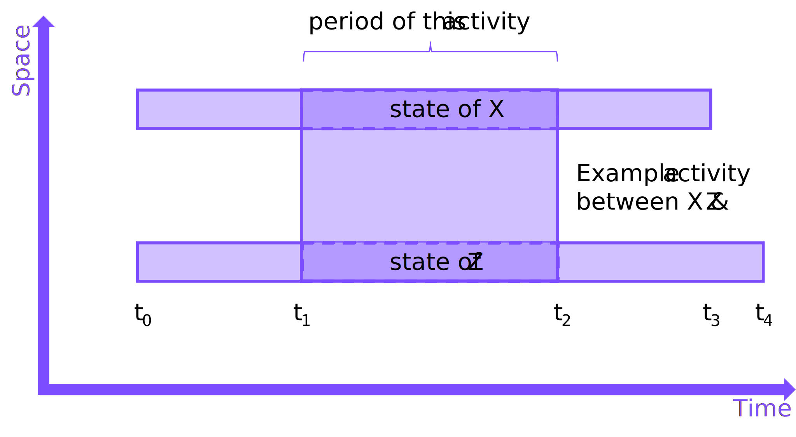
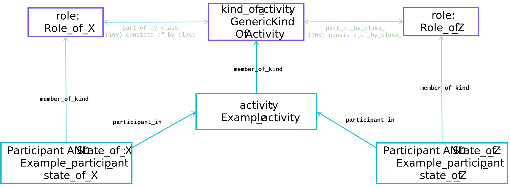
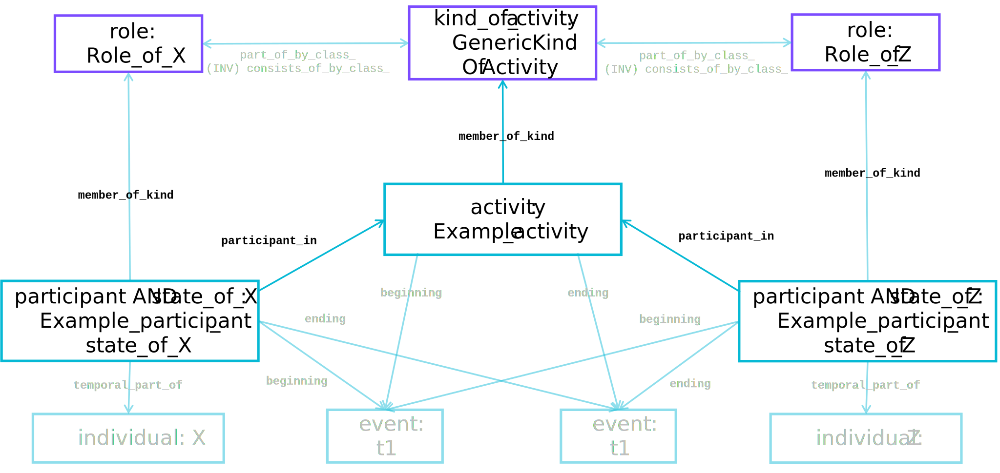

## **activity** Entity Type

Activity: Stuff happening, involving its participants, for a period of time that causes some `event`.  


??? question "What information requirement does this meet?"
    It is common to require information about activities.  Examples include:

    - What happened during yesterday's meeting / site inspection / ...?

    - Who and what was involved during the activity last month?

    - What is planned for our activities in the coming month?

    - What activities led to the successful / unsuccessful events?

    - ...

    The `activity` pattern can be crucial in addressing these sorts of questions, and an almost limitless number of others like them.

This `activity` pattern is a very common one where two or more `individual` objects are involved in some activity for a period of time (e.g. reaching an agreement is an example of an activity where two or more parties determine a course of action).  The [`activity`](https://github.com/hqdmTop/hqdmFramework/wiki/activity) Entity Type is a whole-life individual for the period of the activity between the [`participant`](https://github.com/hqdmTop/hqdmFramework/wiki/participant) states that are involved in it (it `consists_of` its participants).  A useful way to think about activities is that they involve two or more `individual` things in a way that results in some `event`, with HQDM providing a fully stateful way of representing all of the states.  Each `activity` `causes` or `determines` one or more `event`


??? info "Types-Supertype Hierarchy"
    The Entity Type [`activity`](https://github.com/hqdmTop/hqdmFramework/wiki/activity) is a subtype of [`individual`](https://github.com/hqdmTop/hqdmFramework/wiki/individual) and [`state_of_activity`](https://github.com/hqdmTop/hqdmFramework/wiki/state_of_activity).  An [`activity`](https://github.com/hqdmTop/hqdmFramework/wiki/activity) can be a `member_of_kind` one or more [`kind_of_activity`](https://github.com/hqdmTop/hqdmFramework/wiki/kind_of_activity).  An `activity` `consists_of` two or more [`participant`](https://github.com/hqdmTop/hqdmFramework/wiki/participant) states, each of which will be a `member_of_kind` of one or more [`role`](https://github.com/hqdmTop/hqdmFramework/wiki/role).  The `activity` and the `participant` states that it `consists_of` all share the same period of time (the same temporal extent).  `activity` and all of its sub-types `causes` &/or `determines` one or more `event`.  An `activity` may also `reference` one or more `thing` (e.g. )

    --8<-- "activityTypesSupertypes.mermaid"

## Spacetime Diagram
The following diagram illustrates the activity of two states, each state being a `temporal_part_of` an `individual` X and Z respectively.  The constituent states in this `activity` all share the same temporal bounds.  This examples will be implemented below to illustrate the general entity-relationship and data patterns resulting from it.



## Data Object Block Diagrams
The block diagram below illustrates the data objects comprising the generic activity shown on the space-time diagram above.



??? info "Full data object block diagram"
    The diagram below shows additional data objects required to populate the generic activity pattern in full.  This illustrates that there is only ever a need to represent any concrete state (or HQDM class) once - providing these data objects can be accessed and shared.

    


## Implementation
The data objects shown in the diagram above have been implemented using MagmaCore in [`ActivityExample.java`](https://github.com/ClimbingAl/code-for-hqdm-patterns/blob/main/patterns/src/main/java/patterns/hqdm/activity/ActivityExample.java).  The filtered node-edge graphs below correspond to the data objects and their relationships with each other to implement the `activity` pattern.  The `Example_activity_between_X_and_Z` and the `participant` objects named `Example_participant_state_of_X` and `Example_participant_state_of_Z` are shown in the first node-edge graph.

--8<-- "genericActivityAndParticipantsNodeEdgeGraph.mermaid"

??? info "Extended node-edge graph"
    An extended node-edge graph showing some of the additional dependencies is shown next.

    --8<-- "genericActivityAndParticipantsFullNodeEdgeGraph.mermaid"

These examples of `activity` also build on the [individual examples](../individual/individual.md) data object examples, showing how data can be added to existing data that has been consistently generated using HQDM (with MagmaCore, in this case).  The TURTLE dataset showing the data used to generate these node-edge graphs is shown in the tab below.

??? info "TURTLE"
    ``` title="Activity objects example in TURTLE"
    --8<-- "activityGenericPattern.ttl"
    ```

??? tip "Strategies for implementation of the `activity` pattern"
    While HQDM is parsimonious with its entities and relationships there are some implementation choices that may make implementation easier depending on the application, its architecture and data storage facilities.  Here are some suggestions:

    - Don't store the `beginning` and `ending` relationships for each `activity` as they can be queried from the `participant` states that it `consists_of`.

    - If lots of a particular `activity` sub-type need to be created and the set membership of each is the same, consider creating a subtype of `activity` and map it to a storage schema that includes the `participant` states and their `role`s.  This would be a mapping that could be mapped back to a full HQDM schema if/when required.

    - Sometimes the `beginning` or `ending` of an activity isn't completely known (for example, it may still be in-place and the possible ending may be in the future).  In this case only store the `beginning` or `ending` that is known (as long as one of them is known).


## References

HQDM book references: 11.8, 17.14, 17.15, 17.16

Entity Types: [`activity`](https://github.com/hqdmTop/hqdmFramework/wiki/activity), [`participant`](https://github.com/hqdmTop/hqdmFramework/wiki/participant)

MagmaCore (Java) reference: [`activity`](https://github.com/gchq/MagmaCore/blob/main/hqdm/src/main/java/uk/gov/gchq/magmacore/hqdm/model/Activity.java), [`participant`](https://github.com/gchq/MagmaCore/blob/main/hqdm/src/main/java/uk/gov/gchq/magmacore/hqdm/model/Participant.java)

Source code for this example is available [here](https://github.com/ClimbingAl/code-for-hqdm-patterns/blob/main/patterns/src/main/java/patterns/hqdm/activity/ActivityExample.java)


