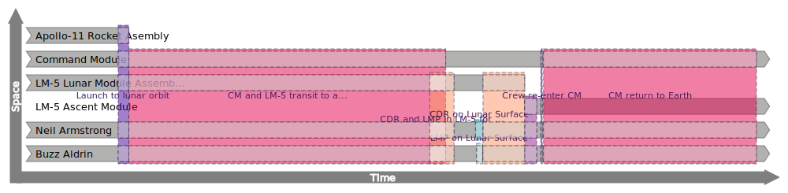
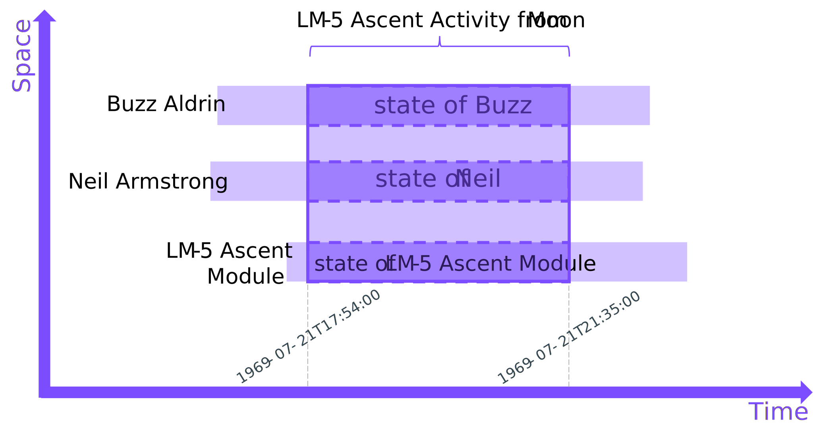
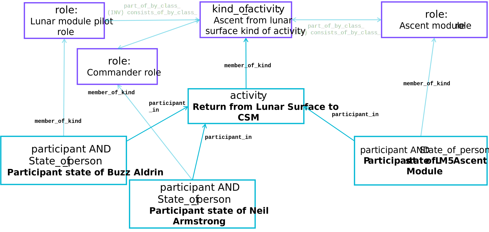
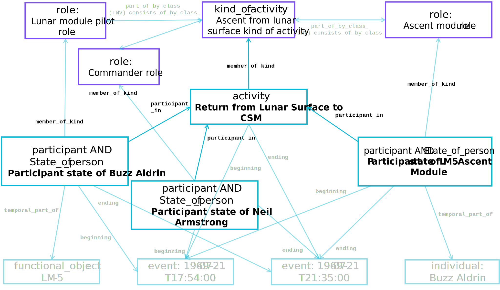

# Apollo-11 Activities involving Eagle and its crew

The Apollo-11 Mission involved a lot of activities, many of which are well documented.  In this section we use NASA-published timings to represent some of the key activities involved in the transport of the Apollo-11 crew members from the launch site at Kennedy Space Center, Florida, to the lunar surface and back(1).  Together these activities constitute an activity lifecycle of a key part of the Apollo-11 Mission (see [here](https://www.cdbb.cam.ac.uk/news/publication-integrated-approach-information-management-identifying-decisions-and-information) for a description of how information requirements can be captured using activity lifecycle modelling).  This worked example introduces some new aspects of the use and handling of the HQDM patterns; mapping data from other sources into MagmaCore, multiple instances of the pattern in a dataset plus querying data from another source.  The Activity Editor used also makes use of some more advanced patterns (e.g. [`sign`](https://github.com/hqdmTop/hqdmFramework/wiki/sign) and [`pattern`](https://github.com/hqdmTop/hqdmFramework/wiki/pattern)) that we shall explore later.
{ .annotate }

1.  This activity lifecycle is from the Saturn-V liftoff, transition of the principal crew modules to lunar orbit, descent to the lunar surface, spacewalks on the surface of the moon (memorable for Neil Armstrong's phrase "one small step for [a] man, one giant leap for mankind."), ascent back to the command module (CM) and return to earth in it.

??? info "Source Data for the Apollo-11 Timeline"
    CSM - Command & Service Module, S-IVB - Third (and final) stage of Saturn V Rocket, CDR - Commander, LM - Lunar Module, LMP - Lunar Module Pilot, "Range zero" - liftoff

    {{ read_csv('../extras/source-images/Apollo11ActivityModelEvents.csv') }}

    Source: [NASA's Apollo-11 Timeline](https://history.nasa.gov/SP-4029/Apollo_11i_Timeline.htm)



Online tool used to create the Apollo-11 Activity diagram is the [Apollo Protocol Activity Editor](https://apollo-protocol.github.io/4d-activity-editor/).  The source data file originally exported from the Activity Editor is available [here](../extras/activity-editor/activity_diagram_state_of_apollo11_mission.ttl), in TURTLE format, and the same data read in to an instance of a [MagmaCoreService.java](https://github.com/gchq/MagmaCore/blob/main/core/src/main/java/uk/gov/gchq/magmacore/service/MagmaCoreService.java) and re-exported is available [here](../extras/example-files/activityEaglePattern.ttl).  The rendering of each of those TURTLE files differs only in the ordering of the `individual` objects in the data files (the Activity Editor allows re-arranging the order of the `individual` objects in the UI using the "Sort individuals" button, the colour scheme can also be adjusted in "Settings").

## Spacetime Diagram
The following diagram illustrates the LM-5 lunar ascent activity, involving three participants being the LM-5 Ascent Module, Buzz Aldrin (as Lunar Module Pilot) and Neil Armstrong (as Apollo-11 Commander)(1).  Each participant state being a `temporal_part_of` an `individual` that represents them as whole-life objects.  The constituent states in this `activity` all share the same temporal bounds.  This examples will be implemented below to illustrate the general entity-relationship and data patterns resulting from it.
{ .annotate }

1.  The activity illustrated on this space-time diagram is taken directly from the Activity Editor diagram above.  It can be identified in the data but is the 6th activity from the left (coloured purple).



## Data Object Block Diagrams
The block diagram below illustrates the data objects comprising the activity shown on the space-time diagram above.



??? info "Full data object block diagram"
    The diagram below shows additional data objects required to populate the generic association pattern in full.  This illustrates that there is only ever a need to represent any concrete state (or HQDM class) once - providing these data objects can be accessed and shared.

    
    
## Implementation
The data objects shown in the diagram above have been imported into a `MagmaCoreService` in [`ActivityEagleExample.java`](https://github.com/ClimbingAl/code-for-hqdm-patterns/blob/main/patterns/src/main/java/patterns/hqdm/activity/ActivityEagleExample.java).  The filtered node-edge graphs below correspond to the data objects and their relationships with each other to implement the `activity` pattern.  The `activity` named "Return from Lunar Surface to CSM" and the `participant` objects representing the states of the LM-5 Ascent Module, Buzz Aldrin and Neil Armstrong in their respective roles during the ascent `activity` are shown as the **bold** nodes in the first node-edge graph.

--8<-- "activityLM5AscentAndParticipantsNodeEdgeGraph.mermaid"

??? info "Extended node-edge graph"
    An extended node-edge graph showing some of the additional dependencies is shown next.

    --8<-- "activityLM5AscentAndParticipantsFullNodeEdgeGraph.mermaid"

??? question "What has changed about the data compared to the `association` example?"
    Well done for spotting this, if you noticed.  The data was generated in the Activity Editor application.  Although the application uses HQDM it employs an independent implementation of HQDM and is based around the information needs of the activity modelling use-case.  Although the data object patterns from HQDM are recognisably similar, the implementation choices resulted in some differences.  One of the significant benefits of HQDM (and the ontological commitments that it is based on) is that independent uses of the model will be recognisably similar.  This aids analysis of the differences and can ease the approach to mapping between such implementations.

    Here are some of the key differences:

    1. The `data_EntityName` predicate is not used for most of the data objects.  This is because there is typically more to assigning a name to something than tagging the data object that represents it with a name property (see [here](../introducing_hqdm/top_level_type.md)).

    2. Following on from this, the `sign` and `pattern` HQDM patterns are used to represent the names entered.  These data objects are not part of the `activity` pattern so are not shown on this page.  However, they are explored [here](../signs_and_patterns/patterns.md) (UPDATE LINK)

    3. Some of the IRIs used are from the Activity Editor namespace (`<https://apollo-protocol.github.io/ns/2023/diagram-editor/diagram#>`).  However, the same HQDM namespace (`<https://hqdmtop.github.io/hqdm#>`) is used.

    4. Some of the entity types (and set membership commitments) differ.  Although this is inevitable between independently implemented systems it allows for straightforward comparison and mapping between these implementations.  One clear difference is that the Activity Editor allows users to create instances of `person`, `organization` and `ordinary_physical_object`.  Subtypes of `ordinary_physical_object` are not supported as this is all that is required for the Editor application.  However, there is a natural path to mapping the resulting data objects to subtypes (including HQDM sub-classes) to refine their classification.  This is explored in the [model mapping section](../implementation_guidance/model_mapping_process.md).

    To illustrate point 1 above, a `data_EntityName` predicate has been added for the four states involved in the `activity` pattern shown in the node-edge graphs above.  The added predicates are in **bold** below:

    --8<-- "activityLM5AscentAndParticipantsWithNamePredicatesNodeEdgeGraph.mermaid"

    Adding or changing predicates is not good practice as the data objects should be treated as immutable to ensure that there is integrity to the data management activities of integrated datasets like these.  This is explored [here](../implementation_guidance/managing_immutable_data.md)


These examples of `activity` also build on the [individual Eagle examples](../individual/individual_LM5.md) and [association Eagle examples](../association/associationEagleCrew.md) data object examples.  However, these examples are not collectively integrated as the `activity` example was generated using a separate application and imported into the MagmaCore-based environment that the previous examples were created in.  Addressing the remaining integration steps is covered in the [model mapping section](../implementation_guidance/model_mapping_process.md).  

The TURTLE dataset showing the data used to generate these node-edge graphs is shown in the tab below.

??? info "TURTLE"
    ``` title="Association objects example in TURTLE"
    --8<-- "activityEaglePattern.ttl"
    ```
??? question "I have noticed that the time values look funny, why is that?"
    Representing time in a computational system is never as straightforward as we may may want to assume.  This is where the use of HQDM also allows a robust way to dealing with different representations of `event` objects that map to *time values* that have a specific context.  In the extended node-edge graph time values like "447720000" can be seen.  To take stock of this we have the following:

    - Published times from NASA that were logged from the original Apollo-11 Mission.  They are given in both GMT date-time format and elapsed time in hhh:mm:ss (although for some they are in integer numbers of seconds and for others they have decimal fractions of a second for the elapsed time from RANGE ZERO, the nominal liftoff point).  Even these two source data formats is not completely consistent.  Some judgement was applied in their use for this worked example (this is a common data wrangling experience and took quite some time to address.  The human readable results are shown in the table at the top of this page).

    - The Activity Editor is implemented in JavaScript and uses the [`Number`](https://developer.mozilla.org/en-US/docs/Web/JavaScript/Reference/Global_Objects/Number) type to store event number values.  This data type is in [double-precision 64-bit binary format IEEE 7540](https://en.wikipedia.org/wiki/Double-precision_floating-point_format). It was not a requirement for the Activity Editor to support actual time values.  In addition, it does not support negative values as the nominal start is always 0, or a declared value above 0.  However, the Activity Editor assigns every instance of `event` to be a `hqdm:member_of  diag:c9ecb65e-4b1f-4633-ac5c-f765e36586f2 ;`.  The uuid value is hard-coded and represents a [`class_of_event`](https://github.com/hqdmTop/hqdmFramework/wiki/class_of_event).

    - Reflecting the duration of the Apollo-11 Mission activities using the Activity Editor required a way of using a positive `number` to represent the `event` times that bounded each `activity` of interest.  Therefore, [Unix time](https://en.wikipedia.org/wiki/Unix_time), as a millisecond tick count from an established "0" (Unix epoch).  However, the Unix epoch started at "00:00:00 UTC on 1 January 1970".  The Apollo-11 Mission took place the year prior to that.  Therefore, the millisecond tick count was re-based to be "0" at the RANGE ZERO time in the NASA timeline.

    `beginning` `event`: "447720000".  This corresponds to: 1969-07-21T17:54:00
    `ending` `event`: "460980000".  This corresponds to: 1969-07-21T21:35:00

    Ensuring that the context of the time values (XML Date-time values for the MagmaCore generated examples and the re-based Millisecond Tick Count values from the Activity Editor) stored in the examples datasets is unambiguous allows mappings between them to be implemented in code, if required.  To adopt this in a repeatable way some further model restrictions could be applied but this hopefully illustrates the potential.

## References

HQDM book references: 11.8, 17.14, 17.15, 17.16

Entity Types: [`activity`](https://github.com/hqdmTop/hqdmFramework/wiki/activity), [`participant`](https://github.com/hqdmTop/hqdmFramework/wiki/participant)

MagmaCore (Java) reference: [`activity`](https://github.com/gchq/MagmaCore/blob/main/hqdm/src/main/java/uk/gov/gchq/magmacore/hqdm/model/Activity.java), [`participant`](https://github.com/gchq/MagmaCore/blob/main/hqdm/src/main/java/uk/gov/gchq/magmacore/hqdm/model/Participant.java)

Source code for this example is available [here](https://github.com/ClimbingAl/code-for-hqdm-patterns/blob/main/patterns/src/main/java/patterns/hqdm/activity/ActivityEagleExample.java)

