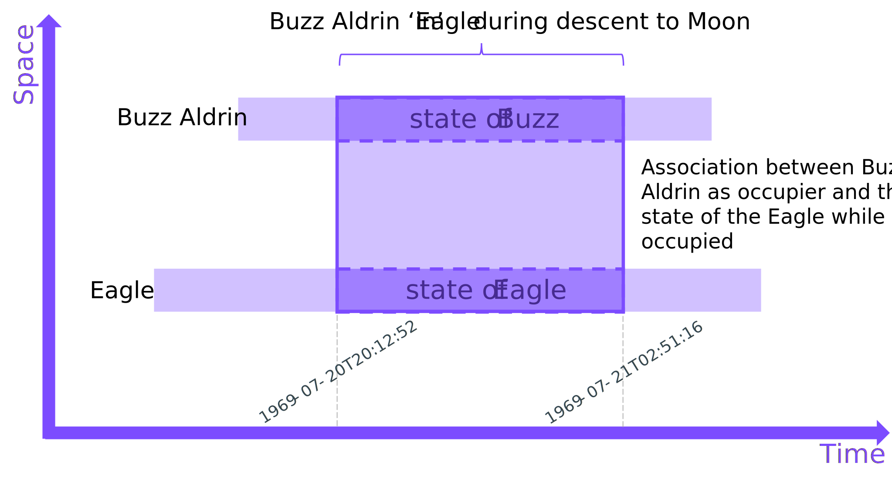
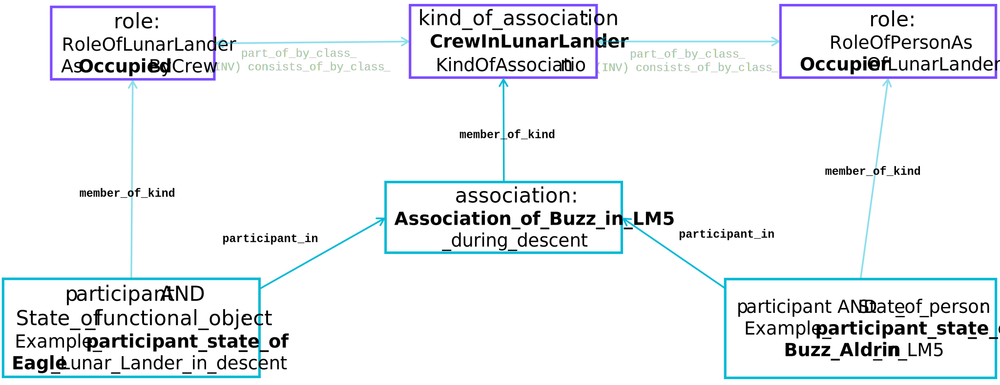
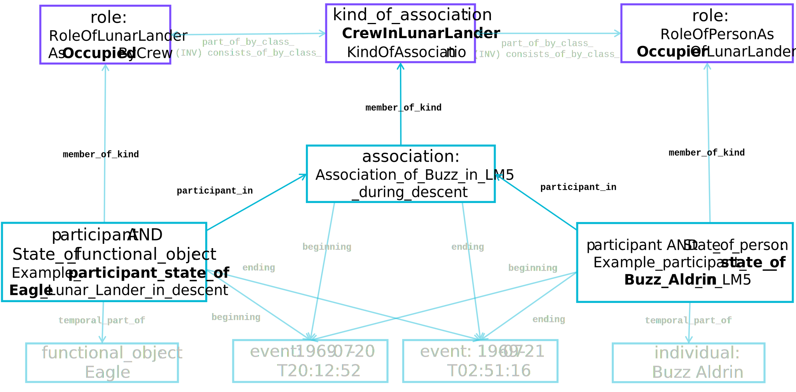

# Eagle Lunar Lander 'Association' with its crew


## Example
For periods of time the *Eagle* lander module was occupied by astronauts that were from the Apollo-11 crew.  Of the three Apollo-11 crew, two individuals, Neil Armstrong (Mission Commander) and Buzz Aldrin (Lunar Module Pilot), made the visit to the lunar surface in the *Eagle*.

??? question "What information requirement does this meet?"
    Operational questions like:

    - Who is/was in a particular Lunar Lander while it was in descent?

    - When did any of the occupants of a Lunar Lander leave/enter it?

    - What was the duration of the crew's descent to the Lunar Surface?

    - What Lunar Lander(s) did Buzz Aldrin crew?

    - ...

    The `association` pattern can be crucial in addressing these sorts of questions.  These sorts of questions can be common for associations in any setting.(ADD HINTS)

This `association` pattern involves one `functional_object` (in this example, the LM-5 Lander called *Eagle*) involved in being occupied by one or more crew member for a period of time.  The crew are [`participant`](https://github.com/hqdmTop/hqdmFramework/wiki/participant) in the [`association`](https://github.com/hqdmTop/hqdmFramework/wiki/association) as being occupiers of the *Eagle*. Therefore, this association  `consists_of` these participants.  The [`role`](https://github.com/hqdmTop/hqdmFramework/wiki/role) of the crew participant(s) is different from the `role` of the *Eagle* in this `association`.

??? question "Why don't we use some concept of the crew being 'in' the *Eagle*"
    When we speak about the *crew who were in the Eagle as it was landing* we are exchanging some semantic information about how some people were situated 'in' the LM-5 Lander.  However, what is actually going on?  The crew are not part of the `functional_object` that is the *Eagle* itself.  While there is a volume of air at a temperature, pressure and oxygen content to sustain the crew these are merely due to the arrangement of the parts of the *Eagle*.  Therefore the minimum we can say is that the crew have an `association` with the *Eagle* for a period of time, and that `association` is of a specific `kind` that maps to our short-hand term "in".

    If we want to support the implementation of a short-hand for what is going on we could refer to this `kind_of_association` as being represented by an "in" name.  This is a naming convention and is beyond the scope of this example.  A related strategy may be to reify the association as an 'in' relationship.  This will be the subject of another page [TBD] but understanding the underlying `association` pattern is necessary before making implementation compromises like this.

??? info "Types-Supertype Hierarchy"
    The Entity Type [`association`](https://github.com/hqdmTop/hqdmFramework/wiki/association) is a subtype of [`individual`](https://github.com/hqdmTop/hqdmFramework/wiki/individual) and [`state_of_association`](https://github.com/hqdmTop/hqdmFramework/wiki/state_of_association).  An [`association`](https://github.com/hqdmTop/hqdmFramework/wiki/association) can be a `member_of_kind` one or more [`kind_of_association`](https://github.com/hqdmTop/hqdmFramework/wiki/kind_of_association).  An `association` `consists_of` two or more [`participant`](https://github.com/hqdmTop/hqdmFramework/wiki/participant) states, each of which will be a `member_of_kind` of one or more [`role`](https://github.com/hqdmTop/hqdmFramework/wiki/role).  The `association` and the `participant` states that it `consists_of` all share the same period of time (the same temporal extent).

    --8<-- "associationEagleTypesSupertypes.mermaid"

## Spacetime Diagram
The following diagram illustrates the association of two states, each state being a `temporal_part_of` an `individual` X and Y respectively.  The constituent states in this `association` all share the same temporal bounds.  This examples will be implemented below to illustrate the general entity-relationship and data patterns resulting from it.



## Data Object Block Diagrams
The block diagram below illustrates the data objects comprising the generic association shown on the space-time diagram above.



??? info "Full data object block diagram"
    The diagram below shows additional data objects required to populate the generic association pattern in full.  This illustrates that there is only ever a need to represent any concrete state (or HQDM class) once - providing these data objects can be accessed and shared.

    


## Implementation
The data objects shown in the diagram above have been implemented using MagmaCore in [`AssociationExample.java`](https://github.com/ClimbingAl/code-for-hqdm-patterns/blob/main/patterns/src/main/java/patterns/hqdm/association/AssociationExample.java).  The filtered node-edge graphs below correspond to the data objects and their relationships with each other to implement the `association` pattern.  The `Example_association_between_X_and_Y` and the `participant` objects named `Example_participant_state_of_X` and `Example_participant_state_of_Y` are shown as the **bold** nodes in the first node-edge graph.

--8<-- "buzzInLM5AssociationAndParticipantsNodeEdgeGraph.mermaid"

??? info "Extended node-edge graph"
    An extended node-edge graph showing some of the additional dependencies is shown next.

    --8<-- "buzzInLM5AssociationAndParticipantsFullNodeEdgeGraph.mermaid"

These examples of `association` also build on the [individual examples](../individual/individual.md) data object examples, showing how data can be added to existing data that has been consistently generated using HQDM (with MagmaCore, in this case).  The TURTLE dataset showing the data used to generate these node-edge graphs is shown in the tab below.

??? info "TURTLE"
    ``` title="Association objects example in TURTLE"
    --8<-- "associationBuzzInLM5Pattern.ttl"
    ```

??? tip "Strategies for implementation of this `association` pattern"
    While HQDM is parsimonious with its entities and relationships there are some implementation choices that may make implementation easier depending on the application, its architecture and data storage facilities.  Here are some suggestions:

    - Don't store the `beginning` and `ending` relationships for each `association` as they can be queried from the `participant` states that it `consists_of`.

    - If lots of a particular `association` sub-type need to be created and the set membership of each is the same, consider creating a subtype of `association` and map it to a storage schema that includes the `participant` states and their `role`s.  This would be a mapping that could be mapped back to a full HQDM schema if/when required.

    - Sometimes the `beginning` or `ending` of an association isn't completely known (for example, it may still be in-place and the possible ending may be in the future).  In this case only store the `beginning` or `ending` that is known (as long as one of them is known).

## References

HQDM book references: 11.8, 17.13, 17.15, 17.16

Entity Types: [`association`](https://github.com/hqdmTop/hqdmFramework/wiki/association), [`participant`](https://github.com/hqdmTop/hqdmFramework/wiki/participant)

MagmaCore (Java) reference: [`association`](https://github.com/gchq/MagmaCore/blob/main/hqdm/src/main/java/uk/gov/gchq/magmacore/hqdm/model/Association.java), [`participant`](https://github.com/gchq/MagmaCore/blob/main/hqdm/src/main/java/uk/gov/gchq/magmacore/hqdm/model/Participant.java)

Source code for this example is available [here](https://github.com/ClimbingAl/code-for-hqdm-patterns/blob/main/patterns/src/main/java/patterns/hqdm/association/AssociationEagleExample.java)
