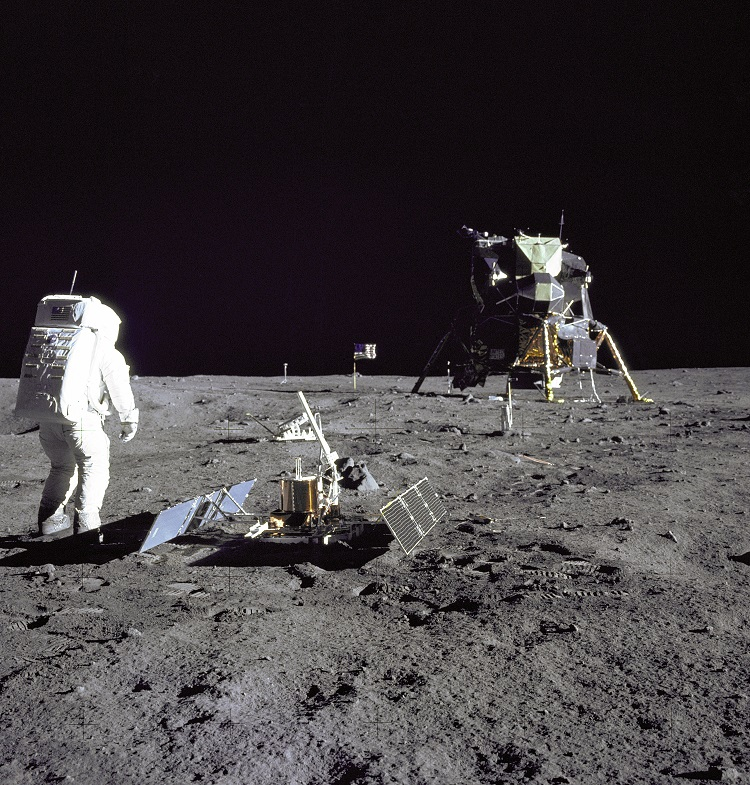

## HQDM model patterns

Welcome to *HQDM Patterns*, documentation on the general model-patterns embedded in the [HQDM](https://www.oreilly.com/library/view/developing-high-quality/9780123751065/) Top Level Data Model.

Why document the 'patterns'?  Well, getting to grips with the theory and structure of the Top Level Data Model (aka. Integration Data Model) that is HQDM is only part of what it takes to make use of it.  In this documentation the model theory underpinning HQDM is taken as given.  We focus instead on the choices involved in implementing the model for some scenarios that are commonly found in information management.  Despite being common, the use of approaches to achieve consistent ways of representing and managing the resulting models is rare.

Do I need to have any background in data integration or the theory behind HQDM to use this documentation?  No.  The goal is to avoid much of the theory (without discarding it) and focus on how the modelling can be applied.  Much of this is about getting this right is about doing good, objective analysis of the need for information.  Many of the patterns in HQDM are both intuitive and emerge naturally from the construction that the book HQDM covers.  Applying them repeatably and effectively can enable a clearer path to managing information and getting the quality of it right for the decisions that it is intended to support.

## Useful pre-reading

* Developing High Quality Data Models by Matthew West, Chapters 1 to 4 (the less theoratical ones &#128578)
* Familiarity with the Information Management Landscape
    - What it takes to manage information in a way that is fit for purpose.  This covers everything that can be identified as necessary to ensure information is managed in a sufficiently mature manner. 
* Use of the [Process-based Information Requirements Methodology](https://github.com/Apollo-Protocol/information-requirement-methodology)
    - See associated [Activity Modeller Tool](https://apollo-protocol.github.io/4d-activity-editor/)
* Initial model mapping results

Understanding the HQDM patterns can help in all of the activities listed above but they are essential to implementation activities, contributing to the consistent application of the model itself and allowing conscious decisions to be made around implementation choises and performance optimisations.

## Format of each pattern

Each model pattern will include the following:

1. Introduction, introducing the pattern and it's place in the HQDM model
2. Type-instance pattern of data objects for each of the patterns
    - Includes example data that is integrated across all the abstract and Apollo-11 based worked examples
3. Lightweight options - decisions that can be made to reduce the number of objects that need to be stored and the compromises involved.
4. Validation and Query options
5. Mapping options

## A scenario for use in the examples

It is generally a good rule to model 'real' things while exploring data models.  The role of data models and the data based on them is to support real-world decisions.  Those decisions will be about real (or at least *possible*) activities and the material stuff involved in, and associated with, them.  Developing models without reference to real, representative examples is a recipe for not capturing what's required.

For this documentation, to enable you to relate to data modelling decisions, how to construct the models and implement them, we will use a well-known, particular activity - the [Apollo-11 mission to the moon](https://www.nasa.gov/mission_pages/apollo/missions/apollo11.html).  As it was the first successful crewed lunar landing and return to Earth it provides plenty opportunity to illustrate key HQDM model patterns that are easy to relate to. In particular, the Lunar Lander Module number 5 (LM-5) that carried the small crew to the surface of the moon, as shown in the NASA image below, will feature strongly.  It is perhaps a poignant time to use this for our worked examples, as NASA (and other national agencies) are returning to the moon with renewed vigour and greater ambitions.  Perhaps they can also benefit from better information management based on model frameworks like HQDM.

_Credit: [NASA Tranquility Base image feature](https://www.nasa.gov/multimedia/imagegallery/image_feature_616.html)_
