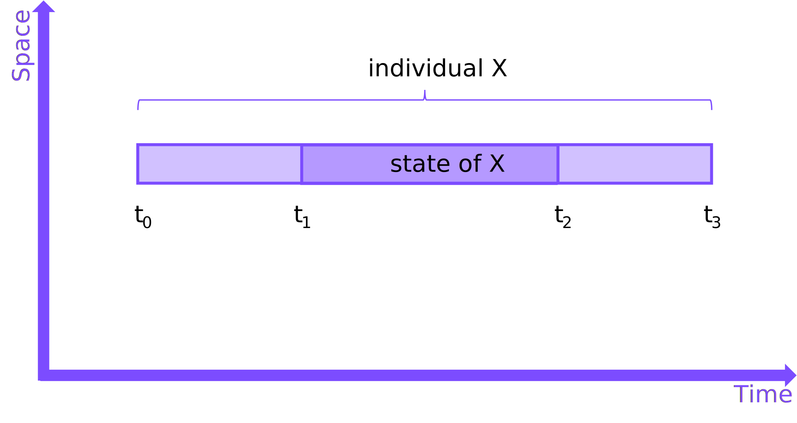

## **individual** Entity Type

One of the first HQDM patterns that is key to many of the more involved patterns is that of 'whole-life' [`individual`](https://github.com/hqdmTop/hqdmFramework/wiki/individual).  


??? info "Types-Supertype Hierarchy"
    The Entity Type [`individual`](https://github.com/hqdmTop/hqdmFramework/wiki/individual) is a subtype of [`state`](https://github.com/hqdmTop/hqdmFramework/wiki/state).  An [`individual`](https://github.com/hqdmTop/hqdmFramework/wiki/individual) can be a `member_of` one or more [`kind_of_individual`](https://github.com/hqdmTop/hqdmFramework/wiki/kind_of_individual).  An instance of [`state`](https://github.com/hqdmTop/hqdmFramework/wiki/state) can be a `temporal_part_of` an instance of [`individual`](https://github.com/hqdmTop/hqdmFramework/wiki/individual), as long as the constructional constraints of parthood are adhered to.  Any particular [`state`](https://github.com/hqdmTop/hqdmFramework/wiki/state), including an instance of [`individual`](https://github.com/hqdmTop/hqdmFramework/wiki/individual), can be `member_of` one or more [`class_of_state`](https://github.com/hqdmTop/hqdmFramework/wiki/class_of_state).

    --8<-- "individualSupertypes.mermaid"

### Spacetime Diagram

This is the first use of a spacetime diagram in this documentation.  These diagrams are useful in showing how distinct, physical things relate to each other (in whole and in part).

The diagram below indicates that a whole-life `individual` exists between two instants in time (`t0` and `t3`) and has a single temporal part, a `state` between `t1` and `t2`.  The actual physical thing that it represents may extend beyond those events and there may (will!) be many more states of it.  It is an information quality decision how diligently the representation is created and maintained to correspond to the actual (or possible) *individual* in the real world.



??? question "How should I interpret a spacetime diagram?"
    While spacetime is familiar territory for physicists it is not a common notion.  However, for many practical modelling situations, it is generally **stuff** that you can point at, kick, measure or sense.  For all the worked examples here it may have been better to call them *stuff-time* diagrams.  

    Most people find it natural to accept that the people they met at a meeting existed continuously for the duration of that meeting (and likely for a significant period prior to and after it).  This is true for other things that are 'real', such as physical equipment, systems, computers, symbols/signs that we can create and interpret to help us communicate, etc.

### Implementation
Each instance of an `individual` will be a `member_of_kind` of some `kind_of_individual` (this pattern is inherited by all subtypes of `individual`).  A node-edge graph that illustrates "Example Individual X" from the diagram above is below.  As SETs (like `kind_of_individual` are not material things they are not shown on a spacetime diagram).

--8<-- "individualAndKindNodeEdgeGraph.mermaid"

The full data object pattern for the `individual` and a `state` that is `temporal_part_of` it is shown in the node-edge graph below.

--8<-- "individualExampleNodeEdgeGraph.mermaid"


??? info "TURTLE"
    ``` title="Individual objects example in TURTLE"
    --8<-- "individualPattern.ttl"
    ```

??? question "Do whole-life individuals exist?"
    While the existence of material things is a central to 4-dimensionalist (perdurant) theory, it is worth asking whether the whole-life (individual) states exist.  States can be temporal parts of other states but is there a distinct category of whole-life states that represent the entire extent of the existence of material objects?  A simple illustration of one of the challenges is the temporal bounds for a whole-life state.  When do you, I or anything else material start and end at definite points in time?  

    A pragmatic response to this question is fourfold:

    1. In the powerset of all states there are sets that correspond to the set of whole-life states.  HQDM recognises them as an entity type that is a subset of the powerset of sets of states.  There are some nuances to this but is beyond the scope of this documentation.  HQDM took a pragmatic stance to address this as a model design decision.

    2. Working out and implementing the `beginning` and `ending` of any state requires care.  It can often be easier to identify the start &/or end events of temporal parts (from which minimum temporal extents of the whole can be derived).  Working out what is appropriate is an implementation decision.

    3. Can we afford not to employ whole-life states?  It can be very difficult to keep track of states if it isn't clear what they are part of.  The `individual` entity type provides a pragmatic mechanism to address this.  This is a modelling decision.

    4. Model implementation requires understanding the information requirement and the associated implementation choices.  If a particular requirement is better served by not using the Entity Type `individual` (and it's subtypes) then this can also be done using HQDM.  This should only be done if the consequences are understood.

??? tip "Strategies for implementation of the `individual` pattern"
    TBC
    Mention `part__of_by_class`

## References

HQDM book references: 11.2, 17.6

Entity Types: [`individual`](https://github.com/hqdmTop/hqdmFramework/wiki/individual), [`state`](https://github.com/hqdmTop/hqdmFramework/wiki/state), [`kind_of_individual`](https://github.com/hqdmTop/hqdmFramework/wiki/kind_of_individual)

MagmaCore (Java) reference: [`individual`](https://github.com/gchq/MagmaCore/blob/main/hqdm/src/main/java/uk/gov/gchq/magmacore/hqdm/model/Individual.java), [`state`](https://github.com/gchq/MagmaCore/blob/main/hqdm/src/main/java/uk/gov/gchq/magmacore/hqdm/model/State.java)

Source code used to generate the data for this `individual` example is available [here](https://github.com/ClimbingAl/code-for-hqdm-patterns/blob/main/patterns/src/main/java/patterns/hqdm/individual/IndividualExample.java).
