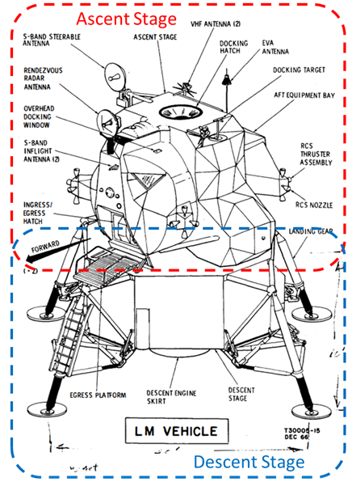
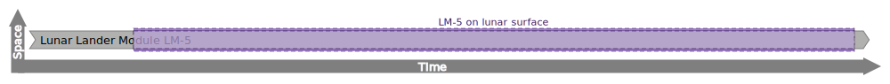

# Eagle Lunar Lander 'Whole-life' Individual


## Example
Instances of the whole-life `individual`, it's temporal parts, and HQDM dependencies generated by the [`IndividualExample`](https://github.com/ClimbingAl/code-for-hqdm-patterns/blob/prefixes/thing/thing/src/main/java/patterns/hqdm/ThingApp.java) and shown in this section.

Our Apollo-11 example will make use of the `individual` and it's temporal parts pattern repeatedly.  To illustrate the pattern we will take a look at the `individual` object that represents the Lunar Lander Module - LM-5 used on that Mission.  This will build on the introduction to [parts](../fundamental_elements/parts.md). Firstly, the `individual`, it's kind and directly related objects (and properties) are shown below, with the identity of the instance of `individual` in __bold__.  To put the diagram into words, the `individual` that is our example Lunar Module LM-5 is a member of the set "KindOfOrdinaryPhysicalObject__Lunar_Lander" and part of one `possible_world`.  

From this record we have no temporal information, which is unsatisfactory (from a 4-dimensionalist perspective, as there is no temporal information, and from an information management perspective, as information is missing about when it existed.  One strategy could be to create `beginning` and `ending` `event`s for this `individual` but we can't be sure of when it started, at least not without more detailed analysis of when and how it was manufactured, prepared and selected for the Apollo-11 mission.  However, we do know that the LM-5 module comprised two principal parts; a decent stage and an ascent stage, together they constitued the LM-5 lander.  We will explore this in more detail in later sections but we do know when LM-5 as a lander ceased to exist as a whole.  The ascent module detached from the descent stage at 17:54:00 GMT on the 21 July 1969.  At that point the LM-5 lander was no longer assembled as one, with the descent module remaing on the surface of the moon(1).  The ascent stage took the crew back to the Command Module and may have subsequently orbited the moon a number of times (after being jettisoned at 23:41:31 GMT) and at some point crashing into the lunar surface(2).
{ .annotate }

1.  This is an eample of a information quailty decision.  We could have cut corners and represented the LM-5 lander in less detail, with less specific information as a result, or we could have represented it in more detail (as we shall see in later sections).  For the illustration of this pattern it was decided that this level of detail is sufficient.

2.  When, or even if, the ascent stage of LM-5 ceased to exist is open to speculation.  See [here](https://www.discovermagazine.com/technology/new-evidence-suggests-apollo-11s-lunar-ascent-module-could-still-be-orbiting){:target="_blank"} for an example of such claims.

??? note "Basic composition of LM-5"
    The design of the LM-5 lander vehicle was in two parts, the ascent stage that housed the astronauts throughout and had the ascent engine and the descent stage that had the landing gear, decent engine and related parts.  

    The Ascent Stage returned the crew to the Command Module orbiting the moon while the Decent Stage remained on the lunar surface.

An illustration of these states of the LM-5 Lander is shown below:



The data object for the `individual` representing Lunar Lander LM-5 is shown below.  There is no beginning event comitted to it but there is a definite ending event (as discussed wbove).

--8<-- "individualAndKindEagleNodeEdgeGraph.mermaid"

However, in the example code we don't just create an `individual` object to represent the Lunar Lander LM-5.  We have 

--8<-- "individualEagleExampleNodeEdgeGraph.mermaid"

??? info "TURTLE"
    ``` title="Eagle Lander as Individual objects example in TURTLE"
    --8<-- "individualEaglePattern.ttl"
    ```
While it is unusual to create instances of the `thing` entity-type, this is the data object structure that will be used for all its sub-types, with the only addition being relationships (as RDF predicates) that are committed in the HQDM model (and, therefore, its patterns).

??? info "Types-Supertype Hierarchy"
    --8<-- "individualEagleSupertypes.mermaid"

## References

HQDM book references: 6.3.7, 7.2.1 & 7.3

MagmaCore (Java) reference: [HQDM Object](https://github.com/gchq/MagmaCore/blob/879e8f119f8defef457ba0caa366ee4aa3335bab/hqdm/src/main/java/uk/gov/gchq/magmacore/hqdm/pojo/HqdmObject.java#L28C1-L28C1), [Thing](https://github.com/gchq/MagmaCore/blob/main/hqdm/src/main/java/uk/gov/gchq/magmacore/hqdm/model/Thing.java)

Other implementation issues:


