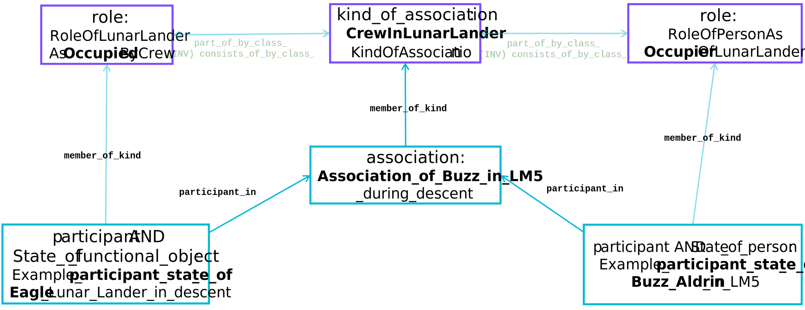

# Diagrams used in this documentation

1. Spacetime diagrams (or maps)

    These diagrams display distinct chunks of spacetime that correspond to the modelling scenario and how parts of them correspond to each other.  They tend to have a fixed time frame of reference but don't treat time linearly, typically using event (points in time) ordering to illustrate how the material things exist over the time period of interest(1).  Rectangular regions in these diagrams correspond to both the actual material stuff being modelled and the data object that is created to represent them.
    { .annotate }

    1.  While spacetime is familiar territory for physicists it is not a common notion. However, for many practical modelling situations, it is generally stuff that you can point at, kick, measure or sense. For all the worked examples here it may have been better to call them stuff-time diagrams.

        Most people find it natural to accept that the people they met at a meeting existed continuously for the duration of that meeting (and likely for a significant period prior to and after it). This is true for other things that are 'real', such as physical equipment, systems, computers, symbols/signs that we can create and interpret to help us communicate, etc.

    ??? info "Spacetime Diagram Example"
        

2. Types-Supertype Hierarchy

    The unified type system in HQDM is one of its great strengths.  The supertype hierarchy up to the root type `thing` is shown for some of the worked examples to illustrate this lineage using [`mermaid.js`](https://mermaid.js.org/) node-edge diagrams using a Top-Down flowchart layout(1).  Types shown in bold borders are used in the HQDM example on the page the diagram is shown.
    { .annotate }

    1. All the `mermaid` diagrams are stored in the site's `\extras\example-files\` directory.

    ??? info "Types-Supertype Hierarchy Example"
        --8<-- "individualSupertypes.mermaid"

3. Data Object Diagrams

    To illustrate the key data objects and their relationships a Data Object Diagram is used to show each data object required to implement the documented pattern and some of the key relationships.

    ??? info "Data Object Diagram Example"
        

4. Data Node-Edge Graphs

    Creating diagrams of structured data isn't easy. Node-Edge graphs are familiar in data science applications but can be difficult to inspect in detail. However, to create node-edge graphs of the example data [`mermaid.js`](https://mermaid.js.org/) is also used with a Left-Right flowchart layout(1).  When the number of nodes and edges increases beyond a clean Node-Edge diagram a filtered collection of relevant nodes and edges is shown instead.
    { .annotate }

    1. All the `mermaid` diagrams are stored in the site's `\extras\example-files\` directory.

    ??? info "Data Node-Edge Diagram Example"
        --8<-- "temporalPartOfAllRelsNodeEdgeGraph.mermaid"

5. Apollo-11 Illustrations

    The release of significant documentation by NASA has been very helpful in constructing a representative information model and worked examples. The aim of this site is to illustrate what it takes to analyse and make decisions about real-world data modelling applications. Without using representative documentation it would be too easy to slip into creating simplified worked examples that don't illustrate the necessary work to model real industrial and large organisational applications.

    ??? info "Apollo-11 Illustration Example"
        Where individual parts of a diagram are relevant to a modelling scenario they will be marked in red.
        

        Source: [Lunar Module Systems Handbook, LM-8 Vehicle](https://www.ibiblio.org/apollo/Documents/LM-8_Systems_Handbook_Rev_B.pdf), November 15 1970

6. TURTLE Snippets

    All the example data is generated as [RDF](https://www.w3.org/TR/rdf11-primer/) and stored in a [MagmaCore](https://github.com/gchq/MagmaCore/tree/main) database.  For this website it is also exported as [TUTRLE](https://www.w3.org/TR/turtle/) and shown in a call-out code block for each example.

    ??? info "TURTLE"
        ``` title="Individual objects example in TURTLE"
        --8<-- "individualPattern.ttl"
        ```