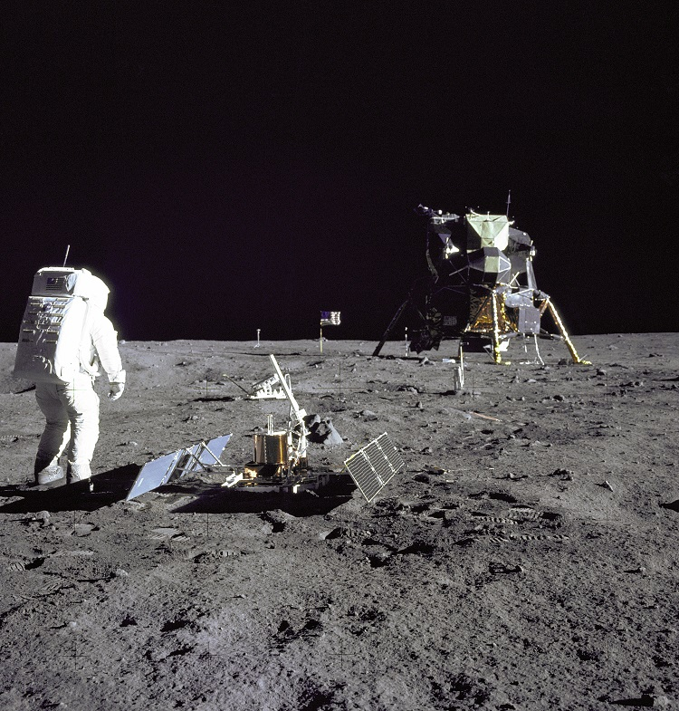

## A scenario for use in the examples

It is generally a good rule to model 'real' things while exploring data models.  The role of data models and the data based on them is to support real-world decisions.  Those decisions will be about real (or at least *possible*) activities and the material stuff involved in, and associated with, them.  Developing models without reference to real, representative examples is a recipe for not capturing what's required.

For this documentation, to enable you to relate to data modelling decisions and how to both construct the models and implement them, we will use a well-known, particular activity - the [Apollo-11 mission to the moon](https://www.nasa.gov/mission_pages/apollo/missions/apollo11.html).  As it was the first successful crewed lunar landing and return to Earth it provides plenty opportunity to illustrate key HQDM model patterns that are easy to relate to. In particular, the Lunar Lander Module number 5 (LM-5) that carried the small crew to the surface of the moon, as shown in the NASA image below, will feature strongly.  It is perhaps a poignant time to use this for our worked examples, as NASA (and other national agencies) are returning to the moon with renewed vigour and greater ambitions.  Perhaps they can also benefit from better information management based on model frameworks like HQDM.

_Credit: [NASA Tranquility Base image feature](https://www.nasa.gov/multimedia/imagegallery/image_feature_616.html)_

Return to [home](./index.md).