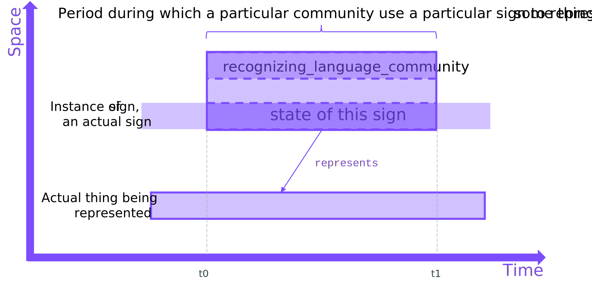

# Representation options based on need

The range and variety of contexts in which *signs* can be used in our daily lives presents some modelling challenges.  How do I capture the information I need relating to *signs* based on the model patterns that are present in HQDM?  These are information requirement trade-off decisions against the cost and complexity of implementing the available patterns.

The starting point is to recognise that we are very unlikely to need all *signs*, their composition and class membership to be captured for all actual, possible and abstract *things* in our domain of interest.  Key *signs* are likely to be the identifiers and names *given* to particular *things* so that they can be recognised and referred to in documents, have physical labels that carry a *sign* attached to them or allow people to find and understand the context of an item (e.g. a document) by its `sign`.

This section presents a range of options that the Author explored while creating the examples.  Not all are implemented but the aim is to illustrate what decisions could be made and the trade-offs involved.  This list of options is not exhaustive. However, they are presented around information management Cases that may help you decide what approach to take for your modelling needs.

#### Case 1: Generic
**I require a solid, repeatable implementation of all *signs* in my dataset handled in the same manner no matter their context**

??? info "Basic 'full' `representation_by_sign`"
    

=== "Pros"

    - Once implemented, it is a natural pattern (actual signs representing actual things).
    - Closest to the conceptual HQDM model.
    - Worth understanding before adopting any of the other patterns.
    - Convenient for associating with external references to the actual signs (e.g. fabrication drawings, photos, strings, etc).
    - `language_community` part useful for recording when changes in agreed terms, identifiers, etc change within an organisation or wider community.

=== "Cons"

    - Verbose
    - Can be excessive for many actual information requirements.
    - Still requires careful `class` management.

#### Case 2: Generic without *language community*
**I require a solid, repeatable implementation of all *signs* but don't need to manage changes to *signs* within the communities that use them**

??? info "Basic `representation_by_sign` showing `recognizing_language_community` only"
    

=== "Pros"

    - As above, without the `language_community` part.

=== "Cons"

    - As above, for Case 1.

#### Case 3: Generic identifiers
**I require a solid, repeatable implementation of all *signs* for *identifiers* of particular (physical) *things* that the communities my information serves**

??? info "Basic 'full' `representation_by_pattern`"
    
    The ellipses outside of the space-time axes denote SETs (subtypes of HQDM `class`).

=== "Pros"

    - Additional framework for the subtypes of HQDM `class` to support *signs* and their *patterns*.
    - *Identifiers* are commonly required in information management systems to represent assets, components, messages and packages that are sent and received, items being stocked, offered for sale and being used, etc.
    - These *identifiers* are often specified to follow a certain pattern.  Specifying that pattern, or the individual elements of the pattern that are used to compose *sign* instances within the model is very useful.

=== "Cons"

    - Verbose.

#### Case 4: Identifiers for *kinds*
**I require a solid, repeatable implementation of all *signs* for *identifiers* of the *kinds* of *things* that my information system needs records of**

??? info "Basic 'full' `representation_by_pattern` for a *kind*"
    
    The ellipses outside of the space-time axes denote SETs (subtypes of HQDM `class`).

=== "Pros"

    - As above, for Case 3.
    - Compatible with fellow subtypes of `representation_by_pattern` like `definition` and `description`, often required to capture the intended interpretation / application of the `represented` *kind*.

=== "Cons"

    - As above, for Case 3.

#### Case 5: Identifiers without *signs*
**I require a solid, repeatable implementation of all *identifiers* that represent the *things* my information system needs records of.  The *individual signs* are less important to me**

??? info "Basic 'full' `representation_by_pattern` without using `sign`"
    
    The ellipses outside of the space-time axes denote SETs (subtypes of HQDM `class`).

=== "Pros"

    - Less verbose.  Avoids the clutter of data objects involved in creating the spatio-temporal instances of *signs* used.
    - Retains the use of `recognising_language_community` to commit to the context in which the identifier is recognised.

=== "Cons"

    - Omits the precision of what specific instances of the *signs* are used to represent the *things* that are `represented` by the `identifier`.
    - Can lead to adding predicates to existing `identifier` records that `consists_of_by_class` a specific `pattern`.  Alternative approach requires a new instance of `identifier` for each use of a specific `pattern`.  Either way this results in a data management compromise.

#### Case 6: Identifiers minimal
**I require a solid, repeatable implementation of all *identifiers* that represent the *things* my information system needs records of.  The *individual signs* and the *connunities* that recognise them are less important to me**

??? info "Basic 'full' `representation_by_pattern` without using `sign` or `recognizing_language_community`"
    
    The ellipses outside of the space-time axes denote SETs (subtypes of HQDM `class`).

=== "Pros"

    - Least-verbose of the Cases (although further compromises could still be made).

=== "Cons"

    - Missing much of the context that the other Cases preserve (to varying degrees).