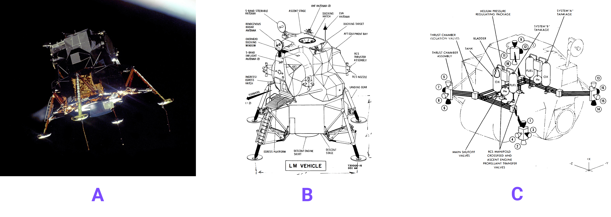

# What are signs?

We tend to take it for granted that we communicate using signs (spoken & visual).  Every word in a sentence represents something.  If the word refers to some physical thing (e.g. "Big Ben", "Eagle", "Apollo-11") then how do we know what these things are?  Often we don't exactly know, but we often don't need to know exactly and we have ways of finding out if we need more context (we ask questions, or do some online searching, etc).  Often the names for things can vary over time, or there can be multiple names for the same things, or names can be subject to errors/mis-translation, or they are expected to be constructed according to a pattern, etc.  If this can happen in the real world, we should be able to represent these situations in data.  This section takes a look at the options and offers some suggestions in how to implement HQDM-based models for them, focussing on situations where the name of a *thing* is used to refer to it directly (e.g. as an identifier).

## Example Signs

We shall use the Apollo-11 Mission to illustrate the challenges and trade-offs.  Let's take the LM-5 Lunar Lander as our starting point.  As illustrated on the [home-page](../index.md) the Lunar Lander Module that landed at Tranquility Base was the number 5 unit, designated "LM-5" by NASA.  The string "LM-5" was formally established, by NASA, as a *sign* to represent the Lunar Lander used for the Apollo-11 Mission.  However, other *signs* were [also used](https://nssdc.gsfc.nasa.gov/nmc/spacecraft/display.action?id=1969-059C):

### NASA's Alternate Names for LM-5

| Name | Description (where needed) |
| :----------------- | :------------------------------------------------------------------ |
| Apollo 11 LM/EASEP | Apollo 11 Lunar Module / Early Apollo Scientific Experiment Package | 
| LM-5               | Lunar Module number 5                                               |
| Eagle              | n/a                                                                 |
| Apollo11EASEP      | n/a                                                                 |
| urn:nasa:pds:context:instrument_host:spacecraft.a11e | [NASA Planetary Data System URN](https://pds.nasa.gov/datastandards/citing/) |

Each of these names have been used by NASA to refer to the Lunar Lander Module number 5.  In the right context they can all be used to refer to the actual LM-5 lander (even after it ceased to exist as a complete unit - see [activity model section](../activity/activityEagle.md)), with some being used formally as *identifiers* that serve as a surrogate for the actual lander itself.  However, it isn't immediately obvious that this is the case when we see them used (some prior knowledge is needed).  Also, at least one of these names ("Eagle") is commonly used in very different contexts.  If we need to be clear about the context in data then we should have facility in the data model to achieve this.

### Audible Signs

The use of audible signs is something we can also take for granted (unless it is a siren or).  The Apollo-11 Mission has the famous recording of Neil Armstrong stating over the radio: “Houston, Tranquility Base here. The Eagle has landed.”.  There is no doubt in that message what the word "Eagle" refers to [audio version here](https://www.nasa.gov/wp-content/uploads/2018/07/62283main_landing.wav) (at 1:42mins into the clip).

### Visual Signs
Character-based signs are not the only sort of sign that may be relevant to referring to actual things

The first image, [A](https://en.m.wikipedia.org/wiki/File:Apollo_11_Lunar_Module_Eagle_in_landing_configuration_in_lunar_orbit_from_the_Command_and_Service_Module_Columbia.jpg), is a photo of LM-5 taken from the Command Module of the Apollo-11 Mission as the lander departed on its journey to the lunar surface.  Image [B] is taken from the [Lunar Lander orientation manual](https://history.nasa.gov/alsj/LM-intro.pdf).  However, we need to take care.  This image is a technical diagram that didn't just represent LM-5, but all Lunar Lander Modules that were designed to that pattern (including those used for testing, training and subsequent Missions that used that model of Lunar Lander, likely LM-5 to LM-9).  Therefore, in that manual it represents a SET of landers.  Image [C] is taken from the same orientation manual but shows just part of the LM system, the Reaction Control Subsystem (the thrusters that kept it orientated correctly).  In this case, Image C represents the set of a part of the Lander Modules.

Of course, icons are often used to represent members of a *kind* of thing, or even an actual thing.  Many people will think of the "Eagle" lander module when they see signs like [this](https://thenounproject.com/icon/lander-1946615/){:target="_blank"}.

## Further uses of signs
Although beyond the scope of this documentation, any combination of signs, any marking, and detectable signal could be used to represent something.  This documentation is a *sign* that represents the body of information (presented as *signs*) that it is composed of.  

Where all, or part, of a *sign* becomes important-enough to have a information records of to be clear about what it is and what it represents, we have a pathway for doing that with HQDM.  An important aspect of *signs* is that the context in which they are recognised as intended is down to the community of individuals (e.g. a group of people, computers, etc) that can participate in that recognition.  For the examples here, the primary community that recognised all of the signs used as illustrations were NASA and the Apollo Programme participants.  Together they needed to recognise those signs to conduct the Apollo Missions.

Let's take a look at the [*sign*](./sign.md) model pattern in HQDM.

