# Eagle Lunar Lander 'System' and its component parts

## `system` and `system_component` in action.  

*Representing actual systems and their composition* worked example.

While it is common to invest in the design and creation of actual *systems*, it is unusual to represent these systems as they actually are.  If we don't admit, in our data models, that these systems (which is most systems that we have today) are dynamic (i.e. can change state) we won't be able to maintain consistent records in data with the state of the actual systems.  We shouldn't be surprised that we fail to keep track of the state of basic systems, and can't address more complex situations in which *systems* can be reconfigured or upgraded (not being able to address this is a limiting factor when we require through-life management or up-to-date situational awareness).

??? question "What information requirement does this meet?"
    It is common to require information about systems.  In fact, managing information related to the lifecycle of functional systems was the primary driver for the creation of ISO 15926 and, subsequently, HQDM.  Examples include:

    - What is the composition of System X now?

    - How many systems use this specific kind of part?

    - What is the maintenance history of part Y?

    - Where is the documentation for each part of the system today?

    - How many parts that have required urgent replacement/maintenance are in critical parts of System Z?

    - If we need to manufacture another system like System K, what parts will we need to buy/make?

    - ...

    The `system` and `system_component` pattern can be crucial in addressing these sorts of questions, and an almost limitless number of others like them.


??? tip "System representation guidance"
    When designing (or, in our case, analysing) a system to have a consistent representation of it (at whatever level of detail is required) some key considerations can help up front.  This list is not exhaustive but should complement good engineering, design and information practices:

    - Each `system_component` part of a `system` maps to a distinct part of the intended (or actual) system.
    - Each `installed_object` only counts once.  That is, each material part of a system should not be represented in data more than once.
        This is an interesting discipline to enforce.  Good systems engineering practices can involve the diagramming of a `system` into sub-systems.  This can lead to ambiguity - is the heat-shield that protects electrical cables from destructive heat part of the electrical sub-system, the propulsion sub-system or the structural sub-system?  Well, the answer is that the heat-shield may play a part in all of those logically separated sub-systems but there is only one heat-shield.  Another example is in more modern computer-based systems; is the embedded computer in a modern `system` that has a Real-Time Operating System that performs tasks for the Guidance, Navigation, Communications and Environmental sub-systems separately part of each of them?  Well, if there is only one such computer in the `system` then it only counts once, even if it has dedicated tasks to support all of those logical subs-systems.
    - Represent things as they are in their own right, before working out whether and how they interact/connect with other distinct things.  Such composition will likely take place at the system level, with many *system components* being systems in their own right.
    - Characteristics of the *system* and its *system components*, such as geometry, physical properties, qualities, etc are likely to be specified as requirements (see [`requirement_specification`](https://github.com/hqdmTop/hqdmFramework/wiki/requirement_specification)) and are therefore *classes* that the *installed objects* are at the (*class membership*) intersection of.


## Spacetime Diagrams
The following diagrams illustrate the Lunar Lander Module, LM-5, and how it was composed as a `system` with many `system_component` parts.  How the *component* parts were arranged is not as complex as may initially appear from the copious design documents made available by NASA.  How these parts worked together was complex, but diligent systems engineering and programme management practices resulted in the clarity they required to make and operate a series of Lunar Lander modules based on a common design with re-use of many of the component parts (to be clear, the actual parts were not re-used, but where the design was re-used they were built to the same specification by the same suppliers).

??? info "The Apollo Space Vehicle System"
    The Apollo Space Vehicle was assembled as a [complete system for launch](https://airandspace.si.edu/explore/stories/apollo-11-launch-vehicle-and-spacecraft).  It comprised the Saturn V Launch Vehicle, itself comprising three rocket stages to provide the lift required to escape the Earth's gravitational influence and set the Apollo spacecraft on a translunar trajectory, plus an instrumentation unit, Lunar Module (LM-5), Service Module, Command Module plus ancillaries like protective covers and a Launch Escape System.  As such, the LM-5 is a *system* in its own right but for part of its existence it was a *system component* of an Apollo Space Vehicle system.  That system changed state significantly as it performed its intended functions and ultimately enabled the LM-5 to operate as a system on its own as it descended successfully to the lunar surface.
    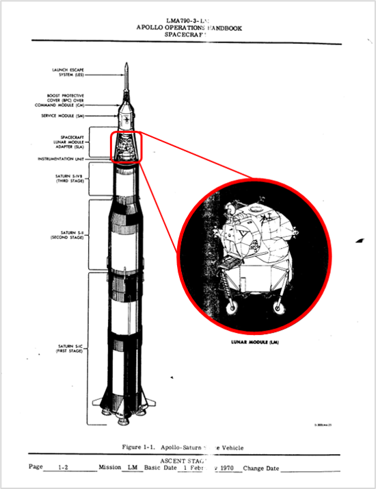

    Source: [Released documents](https://www.ibiblio.org/apollo/Documents/LMA790-3-LM10-ApolloOperationsHandbookLunarModuleLM10AndSubsequent-Volume1-SubsystemsData.pdf) as part of the [Virtual Apollo Guidance Computer Project](https://www.ibiblio.org/apollo/)

??? info "Design of the LM-5"
    Many systems are complicated and can be created from a vast number of parts.  Design, fabrication and assembly of all the parts into an actual system can be an involved, costly, drawn-out undertaking.  Despite a large amount of documentation being created to set out the basis for the system, keeping track of the state of the resulting system can often be ignored or done in an ad-hoc manner.  Maintenance activities can be carried out using original documentation even if the system itself has evolved and diverged from the original design material.  In this LM-5 example we will explore some of these issues.  As an illustration, the following schematic is an extract from one of the Lunar Module's (LM-8) Systems Handbook, a 121MB, 179 page document.
    

    Source: [Lunar Module Systems Handbook, LM-8 Vehicle](https://www.ibiblio.org/apollo/Documents/LM-8_Systems_Handbook_Rev_B.pdf), November 15 1970

Before modelling the LM-5 *Eagle" as a *system* we need to analyse it to ensure that we have a rigorous footing on which to construct a HQDM-based information model.  Firstly, the LM-5 itself was one of a series of Lunar Lander modules involved in the prototyping, unmanned test flights and subsequent lunar landing excursions of the entire Apollo programme.  They were designed to be similar to each other with improvements and new features being added as the Missions advanced what NASA could do.  At the time it was probably the most significant advanced engineering enterprise undertaken under significant geopolitical pressure.  Diligence in the engineering design, test, manufacturing and operation of the entire Space Vehicle was necessary but mostly paper-based.  This worked-example is illustrating how this can be done digitally.

Firstly, we can return to the scenario that we introduced in the [Eagle activity example](../activity/activityEagle.md).  The activities that involved the LM-5 Lander included it descending successfully to the lunar surface.  However, not all of the LM-5 returned the astronauts back to the Command Module that orbited the moon while the LM-5 visited its surface.  One part of LM-5, the *Descent Module* (or *Descent Stage* in some descriptions) remained on the surface of the moon and is still there.  The two astronauts returned in the *Ascent Module* (or *Ascent Stage*, similarly).  So, the LM-5 Module was comprised of two major parts that functioned together as a system and then parted company, with the *Ascent module* having its own propulsion, navigation and control functions to return to lunar orbit.  This is shown in the following diagram.  The whole life `individual` for each of the two parts were assembled separately but brought together in the months prior to the launch (blue star marked on the time axis).  The codes `"1969-059C"` and `"1969-059D"` are the official NASA identifiers designated to each of those Modules (see [`identifier`](../signs_and_patterns/sign_and_pattern_apollo_example.md)).

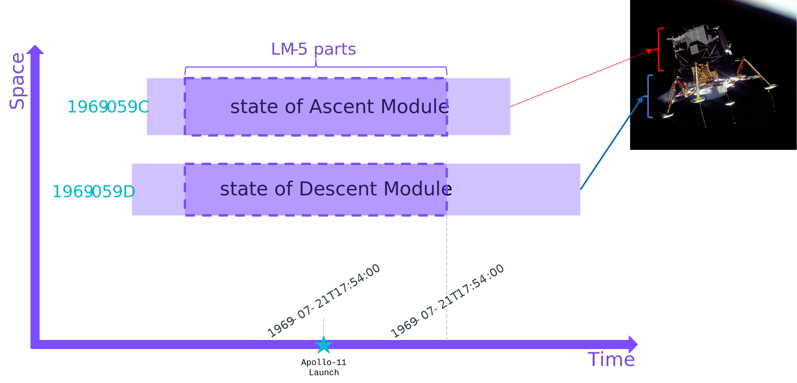

In the previous figure we had no commitment that the two states of the Ascent and Descent Modules were part of a [`system`](https://github.com/hqdmTop/hqdmFramework/wiki/system).  The extent of the `system` is shown by the green dashed line around those states in the next diagram.  Although the whole-life states of the component parts still exist they are not relevant to the diagram of the *system* itself.  Only the relevant parts are diagrammed:

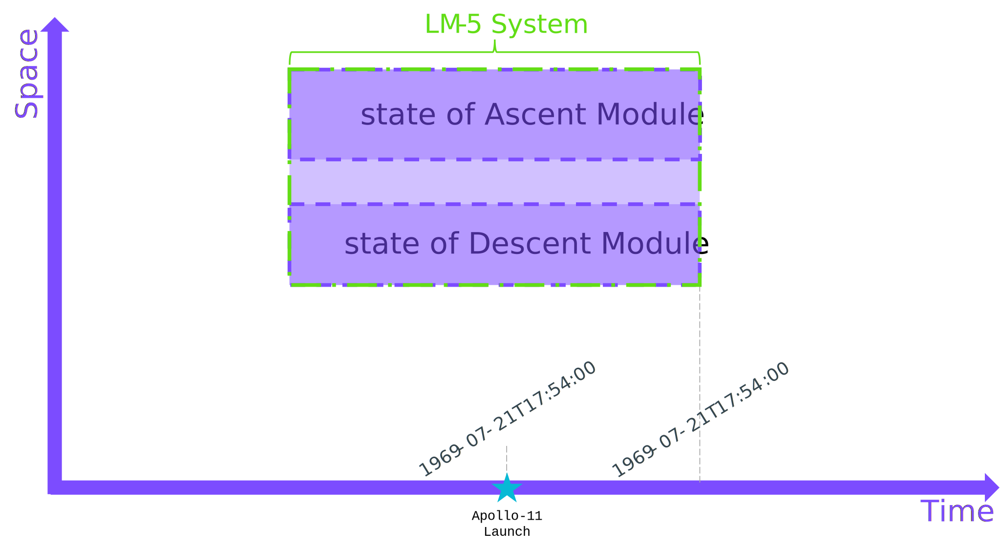

??? example "Equivalent diagram generated from this example's TTL data"
    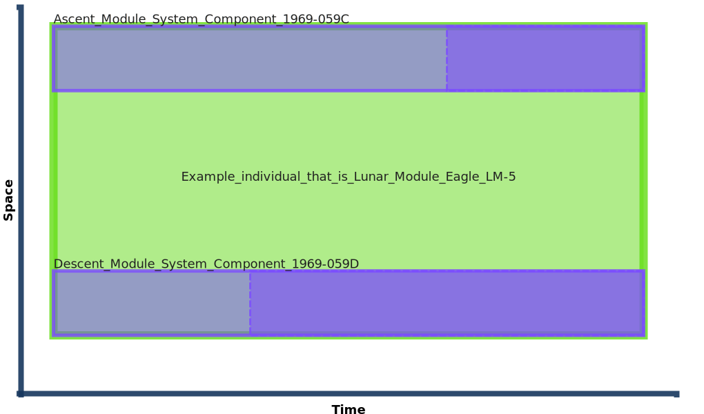
    *Diagram generated using prototype SVG diagram generator using HQDM objects as input TTL.*

However, according to the `system` and `system_component` pattern, a `system` can survive periods of non-existence of its parts.  This will have happened during the assembly and test activities and is a familiar occurrence for those observing the preparations by spaceX of their Starship for launch.  The `system_component` states of the LM-5 System are shown with dashed green lines around the states of the *installed* physical objects that are the states of the Ascent and Descent Modules respectively while installed in the LM-5 *system*.

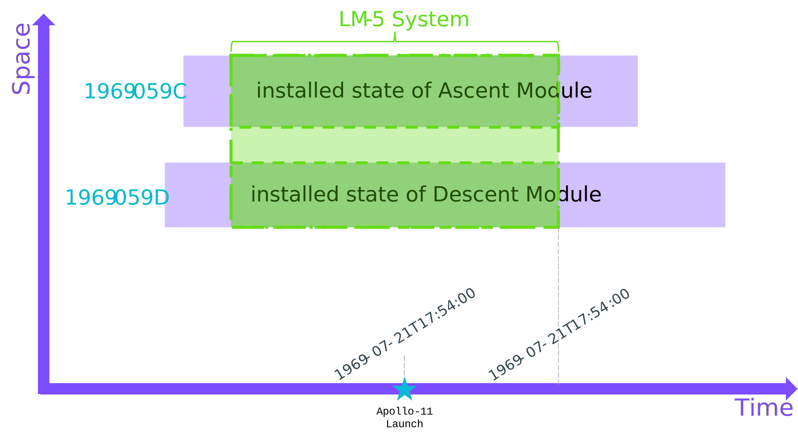

??? example "Equivalent diagram generated from this example's TTL data"
    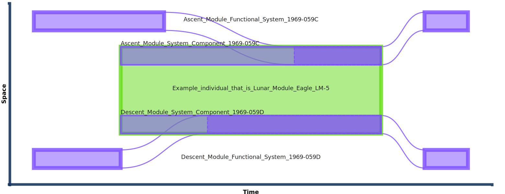
    *Diagram generated using prototype SVG diagram generator using HQDM objects as input TTL.*

From the equivalent diagram above, generated from the HQDM objects for this example, we can see that there is a bit more going on.  The *actual* Descent and Ascent modules are only part of the LM-5 `system` when they are *installed*.  This fits with our prima facie understanding of what comprises a *system*.  Something is only part of a *system* when it is connected in-place (&/or organised) to be part of that *system*.  When something is removed from that situation it generally still exists but is not part of that *system* until it is re-placed (re-installed).  We have the following whole-life data objects to represent the Eagle *system* as just described:

<div class="annotate" markdown>
1. LM-5 System itself ("The Eagle")(1)
2. Descent Module System Component(2)
3. Ascent Module System Component(3)
4. Descent Module System(4)
5. Ascent Module System(5)
</div>
1. "Example_individual_that_is_Lunar_module_Eagle_LM-5" in the TTL and generated diagrams.  This is a given-name of the object for illustrative purposes only.
2. "Descent_Module_System_Component_1969-059D" in the TTL and generated diagrams.  This is a given-name of the object for illustrative purposes only.
3. "Ascent_Module_System_Component_1969-059C" in the TTL and generated diagrams.  This is a given-name of the object for illustrative purposes only.
4. "Descent_Module_Functional_System_1969-059D" in the TTL and generated diagrams.  This is a given-name of the object for illustrative purposes only.
5. "Ascent_Module_Functional_System_1969-059C" in the TTL and generated diagrams.  This is a given-name of the object for illustrative purposes only.

There is also a state of each of #4 and #5 that represents the state of each (sub-)system when it is installed in its respective *system component" (#2 and #3 respectively),

??? info "Full TURTLE for the actual LM-5 System"
    Example LM-5 System and its immediate component parts as HQDM data objects in TURTLE
    ```
    --8<-- "systemAndComponentEaglePattern.ttl"
    ```

??? info "Extended node-edge graph"
    An extended node-edge graph showing some of the additional dependencies is shown next.

    --8<-- "systemAndComponentEagleExampleFullNodeEdgeGraph.mermaid"

??? question "My *system* has lots of parts.  Do I need to model them all to use this model pattern?"
    Great question!  
    
    Most systems have more parts than those who use them realise.  Even the designers, fabricators, maintainers and operators of systems rarely need to know about all of the parts involved.  For large systems, like energy and transport infrastructure or computer-based networks and the communications infrastructure that they interconnect using, there are so many component parts it can be very complex to keep track of the composition of the *system* let alone during operation.  Once operating the functioning of the *system* may depend on the system design decisions many years prior to separate functions with clear interfaces and roles.  This can work well until there is a need to change the system or connect it with other systems.  After that there is a costly task to update design material, often requiring retrospective analysis of design files and surveying the actual system-components to establish their state.  Paving the way for making this a process that is more efficiently done through integrated information can be done using modelling patterns like `system` and `system_component`.

    The good thing about the `system` and `system_component` model pattern in HQDM is that it can be applied in an additive way.  This still requires objective analysis of the physical (or intended-to-be physical) *system* being represented.  This HQDM model pattern helps this objective analysis and do it in a way that allows the modelling to be done within the resources available, and return to it if the resources and need require it. As this worked example is carried it we shall illustrate how this can be done and why there will also be physical things involved that we can't reasonably capture (and, likely, don't need to).

The LM-5 *system* can then be identified by the `system` object for it, the `system_component` parts and any *installed* states that are *temporal_parts* of these *component* states.

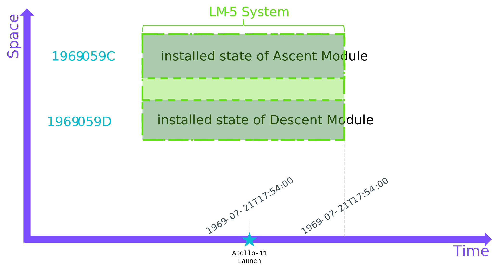

The next diagram shows the `system` and `system_component` parts without the *installed* states, illustrating the pattern for the LM-5 *system* itself.

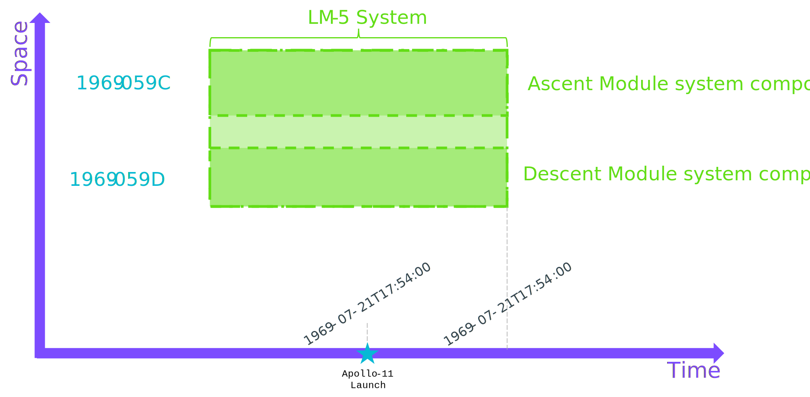

All we need to do to refer to the LM-5 *system* in data is to use the identity (`uuid()`) of the LM-5 `system` object.

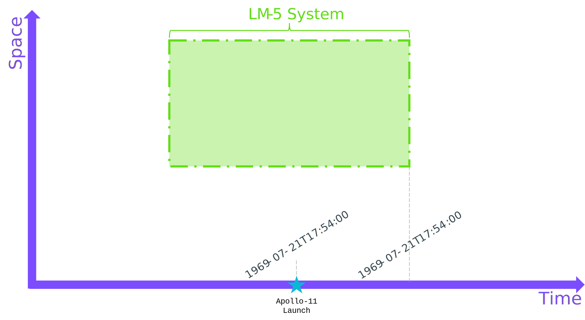

??? question "What if I find that I have missed a component part and want to add it?"
    This is likely to be a common experience.  Luckily, this readily addressable because modelling a *system* is about representing it as it is (the actual system or, if we haven't yet made it, the intended / possible *system*).

    We can add component parts arbitrarily.  This can be useful in certain circumstances.  However, often we may know the likely / intended / possible composition of a system that is being modelled.  Systems engineering is a good example activity that creates representations of the possible future system before it is created.  This can be done with the HQDM model framework by creating classes (generally *kinds*) that the eventual *system* and its *component parts* are *members of*.  If we know that an actual `functional_system` is (or will be) composed of certain `functional_system_component` parts the *system* will be a `member_of_kind` of a `kind_of_functional_system` and will consist of the *kind* of component parts that are related using the `has_component_by_class` relation (related to the `kind_of_functional_system_component` entity type).  In principle, we can create all of the HQDM *classes* that are needed to compose a certain system composition.  This can be very useful if we need to refer to the system, its parts, or the *classes* to compose *requirements specifications* for it.  

    For some systems there will only ever be one of them (e.g. a particular railway, airport or computer network).  In other situations there may be common component parts used across many different systems.  For products like MRI scanners, computers, many engineering tools, mobile phones, etc they are systems in their own right (with many component parts) but many instances of each of those systems can be made.  The HQDM `system` and `system_component` model pattern can accommodate any of them throughout the lifecycle of each.

Of course, each of the `system_component` parts of LM-5 are a `system` in their own right.  This is illustrated for the Ascent Module below.

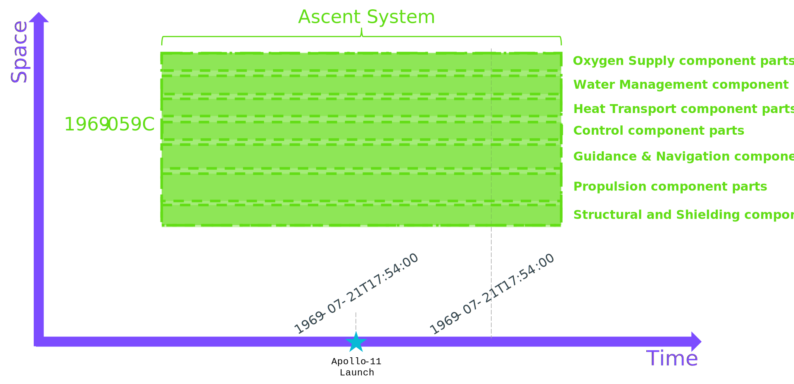

Each of the installed parts will have had an existence prior to being *installed*.  This is shown below.  As before, each of them could be a `system` in their own right, an so on.  We can stop where we run out of a requirement to have information about each part.

??? tip
    It can be better to analyse the system to one level of detail beyond your current need.  This can pave the way to modelling it in more detail in the future and is a good test of the objectivity being applied to the analysis of the *system* to meet your current need.

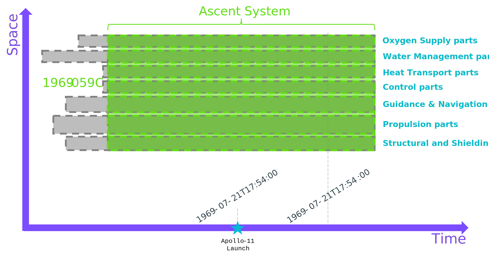

We can now proceed to create HQDM data objects that implement these model patterns (TBC).  If done diligently, this `system` and `system_component` pattern can be used for any *system*.
