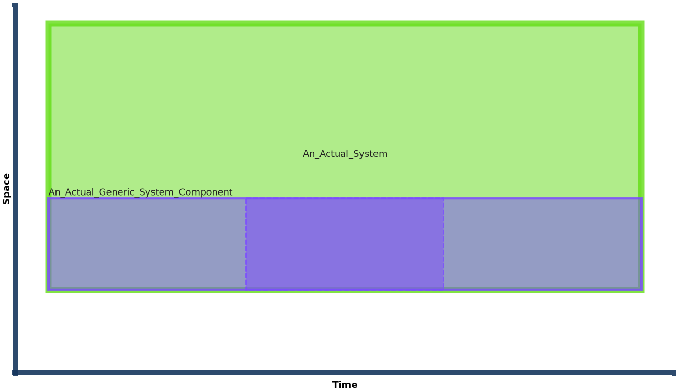
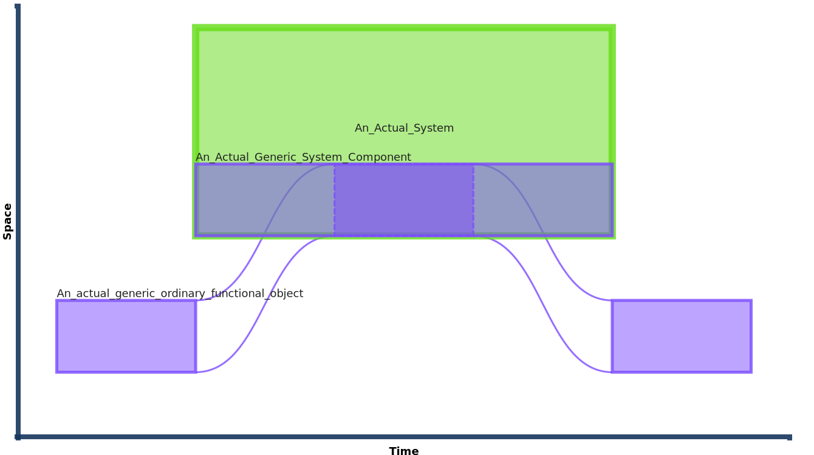
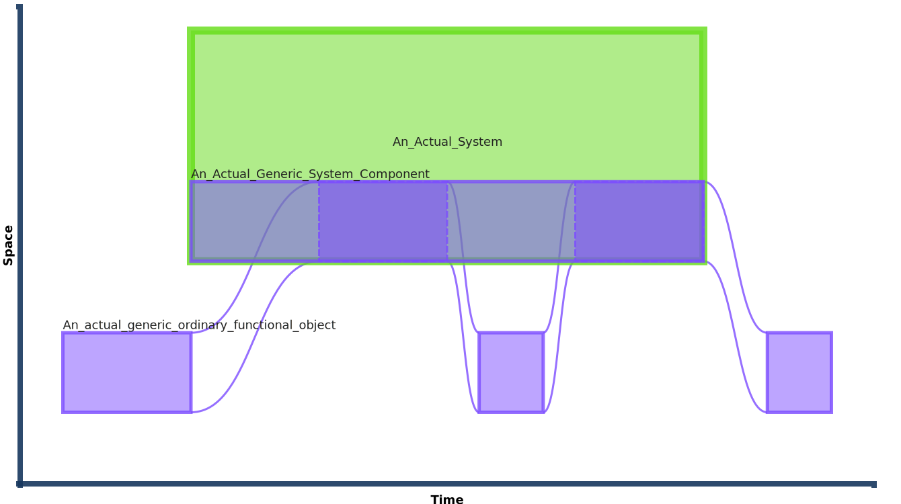

## **system_component** Entity Type

A foundational description of an actual [`system_component`](https://github.com/hqdmTop/hqdmFramework/wiki/system_component) is replaceable component of exactly one `system`.  It is a [`physical_object`](https://github.com/hqdmTop/hqdmFramework/wiki/physical_object) that is a `component_of` a [`system`](https://github.com/hqdmTop/hqdmFramework/wiki/system) and that can be completely replaced without losing identity.  A `system_component`(1) is existence dependent on the `system` it is a component of, unlike any `ordinary_physical_object` that may be installed as the component.
{ .annotate }

1.  A useful discussion on whether *system* and *system_components* are a fundamental pattern can be found **TBD**.  One useful consideration is whether a *system_component* is an **integral part** of the *system* in question.  If the *system* in question can't function (in all *required* aspects) when a particular _candidate_ *system component* is removed, then it is an **integral part** of that *system*.

To relate this description to our experience of *systems* in the 'real' world, it is intuitive that a component of a computer (for example), such as a Solid State Drive (SSD), can be removed or replaced altogether without changing the identity of the computer itself(1).  We can take the SSD card out and leave it out for as long as we want.  The computer may not be able to function while in this state (during this period of time the computer is `state_of_functional_system` and is missing a part).  However, the SSD can be returned to its place within the computer (or a replacement part used in its place) returning the computer as a whole to its *intended* functional state (i.e. it can be a participant in `activity` in its `intended_role, see [here](system.md)).
{ .annotate }

1.  Sometimes replacing a previous component with a different one can materially change the state of the system itself (e.g. adding a larger capacity SSD, or one formatted with a different filesystem can change the state of the entire system beyond a like-for-like replacement).  A good question to ask is whether the system as a whole is sufficiently similar to its previous state/configuration to warrant still being considered as the same *system*.  Often it will.  However, this should be a consideration by the information modeller (or, even better, the organisation requiring the information relating to the states of the *system* that they need information about).

So, the *system component* survives periods when there is no material component part installed.  This is the final part of the *system* and *system component* pattern.  When there is a state of a *physical object* installed as a state of a particular *system component* we have an *ordinary* situation in which the component exists and can perform its intended function(s)(1).  This example includes the creation of a state of an [`ordinary_functional_object`](https://github.com/hqdmTop/hqdmFramework/wiki/state_of_ordinary_functional_object) that is also a subclass of [`installed_functional_system_component`](https://github.com/hqdmTop/hqdmFramework/wiki/installed_functional_system_component), allowing a state of a candidate physical object to be *installed* as a `temporal_part_of` the *system component*.
{ .annotate }

1.  It may still not be able to perform its intended function(s), for example if it is damaged or mis-configured.  This is just to do with its *state* and is a valid situation to model but is left as an exercise to the reader (unless there is a request for the example to be extended to include this).

For this page we shall introduce a *functional system component* as a distinct whole-life individual that is `component_of` the *functional system* that we created in the [previous page](./system.md).  We shall use a series of spacetime diagrams to illustrate the nature of 

### Spacetime Diagram

The diagram below indicates that a whole-life `functional_system_component` exists between two points in time (in the graphs and TTL below you can see that we have used real date-times to allow the generation of this spacetime diagram from the data).  The temporal extent of the *functional system component* matches that of the *system* that it is a `component_of`.  The existence  of the *system component* is dependent on the existence of the *system* so even if there are no *beginning* or *ending* events that set temporal bounds for the *system component* the parthood relation `component_of` means that it solely *part of* the *system*.  The instance of the `functional_system` in the diagram is the same one in the spacetime diagram on the [previous page](system.md) but the colour is green indicating that it has component parts.  The generic component shown in purple has a state (darker purple enclosed rectangle) that indicates that there is a temporal part that is an *installed* state.


*Diagram generated using prototype SVG diagram generator using HQDM objects as input TTL.*

We can extend the spacetime diagram to show the generic *ordinary functional object* that, for a period of time, is *installed* as the *system component* of this generic *system*.  The curved lines indicate that the spatio-temporal extent of the *system component* and the actual object that is *installed* as that *component* coincide (they are the same thing materially, for that period of time).  From the diagram it can be seen that the *installed* part is removed.


*Diagram generated using prototype SVG diagram generator using HQDM objects as input TTL.*

If we add another state in which the same part is re-installed as the *system component* for the rest of the existence of the *system* the resulting spacetime diagram is below.  Adding the new state is trivial as we now have the necessary HQDM classes as part of the worked example.


*Diagram generated using prototype SVG diagram generator using HQDM objects as input TTL.*

### Implementation
Each instance of an `functional_system_component` will be a `member_of_kind` of some `kind_of_functional_system_component` (this SET membership pattern is inherited by all subtypes of `individual`).  A node-edge graph that illustrates "An_Actual_Generic_System_Component" from the spacetime diagrams above is shown below (the data object `id` for the instance of `functional_system` itself is shown in bold to illustrate the *system* as the anchor for the *component*).  

--8<-- "systemAndComponentExampleNodeEdgeGraph.mermaid"

??? info "System and Component with their Kinds node-edge graph"
    
    --8<-- "systemAndComponentAndKindsExampleNodeEdgeGraph.mermaid"

??? info "System and Component Full node-edge graph"
 
    --8<-- "systemAndComponentExampleFullNodeEdgeGraph.mermaid"

??? info "System and Component with Installed State node-edge graph"

    --8<-- "systemAndInstalledComponentExampleNodeEdgeGraph.mermaid"

??? info "System and Component with Installed State, including Events, node-edge graph"

    --8<-- "systemAndInstalledComponentEventsExampleNodeEdgeGraph.mermaid"

From the node-edge graphs it can be seen that for this kind of (admittedly generic, for this example,) *system* there is a `has_component_by_class` relation.  This is an indication that *systems* of this *kind* comprise component(s) of a certain *kind*.  Our *system component*, an instance of `functional_system_component` is a `member_of` this *component kind* (there is an equivalent reverse relationship `part__of_by_class` shown too).

??? info "TURTLE - Install only"
    This TURTLE also includes the `functional_system` objects that are part of this worked example and are discussed in [this](system.md) page.

    ``` title="Functional system component objects install example in TURTLE"
    --8<-- "systemAndComponentPattern.ttl"
    ```

??? info "TURTLE - Install and uninstall"
    This TURTLE also includes the `functional_system` objects that are part of this worked example and are discussed in [this](system.md) page.

    ``` title="Functional system component install and uninstall objects example in TURTLE"
    --8<-- "systemInstallAndUinistallPattern.ttl"
    ```

??? question "What about dynamic systems and their components?"
    TBC.


??? tip "Strategies for implementation of the `functional_system_component` pattern"
    TBC.  Cover system design, system analysis and additive approach.

## References

HQDM book references: 14, 17.10, 17.17, 17.19, 17.27, 17.28

Entity Types: [`functional_system_component`](https://github.com/hqdmTop/hqdmFramework/wiki/functional_system_component), [`state_of_functional_system_component`](https://github.com/hqdmTop/hqdmFramework/wiki/state_of_functional_system_component), [`kind_of_functional_system_component`](https://github.com/hqdmTop/hqdmFramework/wiki/kind_of_functional_system_component)
, [installed_functional_system_component](https://github.com/hqdmTop/hqdmFramework/wiki/installed_functional_system_component), [class_of_installed_system_component](https://github.com/hqdmTop/hqdmFramework/wiki/class_of_installed_functional_system_component)

MagmaCore (Java) reference: [`functional_system_component`](https://github.com/gchq/MagmaCore/blob/main/hqdm/src/main/java/uk/gov/gchq/magmacore/hqdm/model/FunctionalSystemComponent.java), [`state_of_functional_system_component`](https://github.com/gchq/MagmaCore/blob/main/hqdm/src/main/java/uk/gov/gchq/magmacore/hqdm/model/StateOfFunctionalSystemComponent.java), [`kind_of_functional_system_component`](https://github.com/gchq/MagmaCore/blob/main/hqdm/src/main/java/uk/gov/gchq/magmacore/hqdm/model/KindOfFunctionalSystemComponent.java), [installed_functional_system_component](https://github.com/gchq/MagmaCore/blob/main/hqdm/src/main/java/uk/gov/gchq/magmacore/hqdm/model/InstalledFunctionalSystemComponent.java), [class_of_installed_system_component](https://github.com/gchq/MagmaCore/blob/main/hqdm/src/main/java/uk/gov/gchq/magmacore/hqdm/model/ClassOfInstalledFunctionalSystemComponent.java).

MagmaCore (Java) builder classes: [`FunctionalSystemComponentBuilder.java`](https://github.com/gchq/MagmaCore/blob/main/hqdm/src/main/java/uk/gov/gchq/magmacore/hqdm/rdfbuilders/FunctionalSystemComponentBuilder.java), [`StateOfFunctionalSystemComponentBuilder.java`](https://github.com/gchq/MagmaCore/blob/main/hqdm/src/main/java/uk/gov/gchq/magmacore/hqdm/StateOfFunctionalSystemComponentBuilder.java), [`KindOfFunctionalSystemComponentBuilder.java`](https://github.com/gchq/MagmaCore/blob/main/hqdm/src/main/java/uk/gov/gchq/magmacore/hqdm/rdfbuilders/KindOfFunctionalSystemComponentBuilder.java), [`InstalledFunctionalSystemComponentBuilder.java`](https://github.com/gchq/MagmaCore/blob/main/hqdm/src/main/java/uk/gov/gchq/magmacore/hqdm/InstalledFunctionalSystemComponentBuilder.java), [`ClassOfInstalledFunctionalSystemComponentBuilder.java`](https://github.com/gchq/MagmaCore/blob/main/hqdm/src/main/java/uk/gov/gchq/magmacore/hqdm/rdfbuilders/ClassOfInstalledFunctionalSystemComponentBuilder.java).

Source code used to generate the data for this `system_component` example is available [here](https://github.com/ClimbingAl/code-for-hqdm-patterns/blob/main/patterns/src/main/java/patterns/hqdm/system/SystemAndComponentsExample.java).