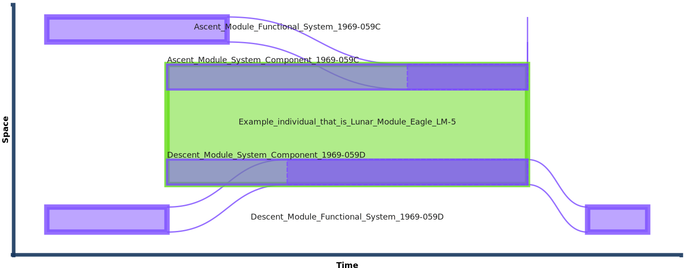
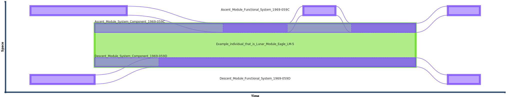

# Eagle spatio-temporal extents by diagram

This page explores the interpretation of the HQDM data objects that represent the parts of the `system` and `system_component` example introduced in [this](./system_LM5.md) page.  The space-time diagrams have all been generated from the data objects created for the worked example, with each diagram illustrating a number of different ways of interpreting the material items modelled using the *system* and *system_component* pattern.

??? note "Interpretation of the generated space-time diagrams"
    * The time axis is not scaled linearly (unless marked as such).  Bounding events are ordered and separated equally.
    * Each horizontal row represents a distinct spatio-temporal region (generally a whole-life `individual` that can have temporal parts, also known as *states* - bounded by dotted lines).  A whole-life individual is bounded by a solid line and are typically coloured purple.
    * A bounding box that covers more than one horizontal row is an aggregation of more than one part for a period of time.  *system components* are an example of parts of a *system*, an aggregation of parts.  When a *system* is shown with *component parts* it has a green boundary.
    * Where a state of an individual is an integral part of a system (e.g. when an iten is installed as a temporal part of a system component) that state is projected into the system component and a curved boundary is used to extend the *individual* 'into' the corresponding *system component*.  If a curved boundary overlays with other *individual* rows there is no meaning intended.
    * Some individuals are bounded by thicker lines to mark them as special objects.  *system* objects are an example of this.

The first space-time diagram shows the 5 *individual* objects representing the Eagle LM-5 as a *system* (green rectangle), its two *system components* (the Descent and Ascent system components) and two *systems* (the actual Descent and Ascent modules) that are each installed to their corresponding *system components* for a period of time.  The ending of the LM-5 system results from the separation of the Descent and Ascent modules when the latter takes the crew from the lunar surface back to the Command Module that was orbiting the moon at the time of the moon landing.  At that point the LM-5 system ceased to exist.  However, each part remained in existence for at least a short period of time.  The Ascent Module returned the crew to the orbiting Command Module and likely crashed into the Lunar surface in the following months(1). The descent module still remains on the lunar surface.  After each Module separated each was able to function as a *system* in its own right.
{.annotate}

1. Although, as mentioned [here](../individual/individual_LM5.md), theories have been put forward that it could still be orbiting the moon.

*Diagram generated using prototype SVG diagram generator using HQDM objects as input TTL.*
 
The diagram above shows the green bounding box of the Eagle *system* itself from a point early on in its manufacture in which it was decided that it existed(1).  The two purple rectangles within the green region (for its full duration) represent the two major *system components*; the Descent and Ascent Modules.  As they are both of the type `functional_system_component` they can survive periods of non-existence(2).  These *system components* are represented as *part of* the LM-5 *system* as they each have the relationship `component_of` connecting them to the LM-5 `system` data object.  Their extents are not shown to extend beyond the extents of the LM-5 *system* as the `component_of` relation entails that each *system component* is part of this particular *system* and no more(3).  The darker regions of each *system component* represents a state of each in which an actual part is *installed* in the place of the *system component*.  The diagram shows that the Descent Module was installed prior to the Ascent Module(4).  Finally, the extents of the actual Descent and Ascent *systems* that are the *components* of LM-5 are shown to extend before and after their existence when *installed* in the LM-5.  This also fits with our understanding of what actually happened; first, each *component* module was manufactured separately and then assembled 'into' the LM-5.  Second, as mentioned above, each *component* module existed for some time after their separation from LM-5.
{.annotate}

1. This is an illustration of an information (and operational) decision.  It could be argued that the LM-5 *system* didn't exist until it was initially assembled in full, or until all the parts were on-hand to commence initial assembly.  However, the important part is that those needing the information are happy with the data record.
2. They can regarded as placeholders for the intended component that is needed for the *system* to function.
3. This is an implication of the logic commitments in HQDM (section 11.1).  Of course, to support this in the diagram generator and any other application this entailment needs to be computed.
4. The Descent Module was the supporting structure for the Ascent Module in the LM-5 Lunar Module, so the Descent Module is naturally installed first.

What can we infer from the data?  We should aim to be clear about what is, and isn't, implied by the data in this example dataset(1).  There is no information present in the dataset about whether, and for how long, the Ascent and Descent Modules carried on existing after their separation from the LM-5 system.  The next diagram illustrates something that may be closer to what actually happened.  The Ascent Module may have ceased to exist as a system by crashing into the lunar surface not long after crew returned in it to the Command Module orbiting the Moon.  However, if we want to assert one or both of those scenarios we need to add some more data objects to our dataset to add that clearly.  In the absence of such data we can't be sure.  So, a valid and revised space-time diagram for our scenario could omit the existence of the Ascent model beyond the last known state.  A revised diagram of this is shown below:
{.annotate}

1. We should take this approach with all data, but we will familiarise ourselves with possible interpretations of the data using this worked example.

*Diagram generated using prototype SVG diagram generator using HQDM objects as input TTL.*

Given that we don't have any state information on the existence of the Descent Module beyond the event that separated the two sub-systems of LM-5 the next diagram could be a valid interpretation of the data:

*Diagram generated using prototype SVG diagram generator using HQDM objects as input TTL.*

Finally, a minimised view of the LM-5 *system* and its *component parts* is shown below.  While we could logically infer that the *systems* installed as the *system compoents* of LM-5 had to have existed prior to their installation(1).
{.annotate}

1. We should also be careful about such assertions.  It may be that the installation of the parts of tha Ascent and Descent Modules took place in-situ (this didn't happen, and LM-5 was separated into two parts prior to its re-assembly and installation in the Apollo-11 Space Launch Vehicle, but it illustrates what could have happened if we are missing structured data on it).

*Diagram generated using prototype SVG diagram generator using HQDM objects as input TTL.*

The note below illustrates the addition of a state of the Ascent Module that was installed and then removed from the LM-5 *system*, as actually happened when LM-5 was transported to the Apollo-11 launch location in 1969.

??? note "Un-installing parts"
    As with SpaceX's well-publicised assembly and disassembly of its prototype [Starship](https://www.spacex.com/vehicles/starship/) space launch vehicles, making functional systems can involve removing component parts temporarily to either replace them or to work on the component in a suitable environment separate from the *system* that they are intended to be part of.  To illustrate this an state of the Ascent Module has been introduced to LM-5 prior to the state of the complete system that was used for the Apollo-11 Mission.  The diagram below shows that earlier installed state being introduced and then un-installed from the LM-5 *system*.

    
    *Diagram generated using prototype SVG diagram generator using HQDM objects as input TTL.*

Which diagram is correct?  Well, it depends on the decisions taken to construct the model and data in the first place, its purpose and what the diagrams are intended to convey.  They first diagram is likely the most useful as it illustrates the existence of the actual *systems* that were used as *component parts* of LM-5 prior to and after the existence of the LM-5 system itself.

